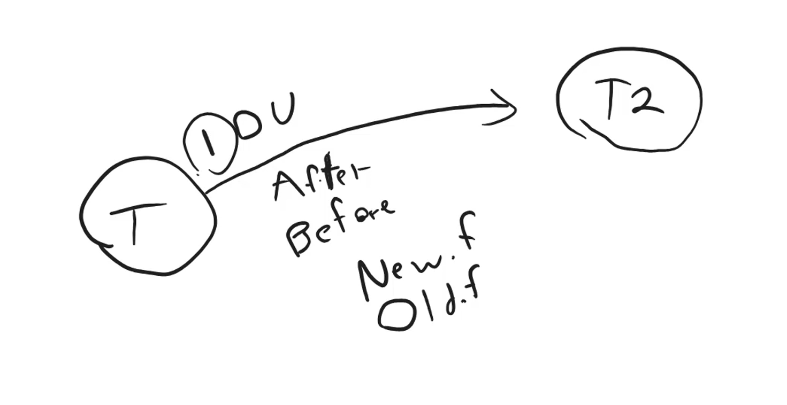

## Triggers

Es un procedimiento almacenado que se ejecuta automaticamente cuando ocurre un evento en la base de datos.

### Eventos

- INSERT
- UPDATE
- DELETE

El timing define el momento en que se ejecuta el trigger.

### Timing

- BEFORE
- AFTER

Tenemos dos entidades aplicado el trigger

- NEW
- OLD

NEW: contiene los valores de la fila que se esta insertando o actualizando.
OLD: contiene los valores de la fila que se esta eliminando o actualizando.



### Creación de un trigger

Creamos una tabla base log_product_price

```sql
USE store;

CREATE TABLE log_product_price
(
    id INT AUTO_INCREMENT PRIMARY KEY,
    product_id INT,
    created_at DATETIME NOT NULL DEFAULT CURRENT_TIMESTAMP,
    old_price DECIMAL(8,2),
    new_price DECIMAL(8,2),
    FOREIGN KEY (product_id) REFERENCES product(id)
);
```

Para crear el trigger es como crear una función

```sql
USE store;

DROP TRIGGER IF EXISTS save_log;

CREATE TRIGGER save_log
DELIMITER $$
$$
CREATE TRIGGER save_log
AFTER INSERT ON product
FOR EACH ROW
BEGIN
    INSERT INTO log_product_price (product_id, old_price, new_price)
    VALUES (NEW.id, 0, NEW.price);
END$$

DELIMITER ;
```

Este trigger se encarga de insertar un registro en la tabla log_product_price, despues de insertar un nuevo product, con el precio inicial en 0 y el precio nuevo en el precio del producto.

```sql
INSERT INTO product (name, price)
VALUES ('Cervesa Corona', 50);
```

### TRIGGER EN UPDATE

```sql
USE store;

DROP TRIGGER IF EXISTS save_log_update;

CREATE TRIGGER save_log_update
DELIMITER $$
$$
CREATE TRIGGER save_log_update
AFTER UPDATE ON product
FOR EACH ROW
BEGIN
    IF NEW.price != OLD.price THEN
        INSERT INTO log_product_price (product_id, old_price, new_price)
        VALUES (NEW.id, OLD.price, NEW.price);
    END IF;
END$$

DELIMITER ;
```

Este trigger se encarga de insertar un registro en la tabla log_product_price, despues de actualizar un producto en product, compara si el precio es diferente y si es diferente inserta un registro en log_product_price con el precio anterior y el precio nuevo.

Para ejecutar el trigger es como ejecutar una sentencia sql

```sql
UPDATE product
SET price = 66
WHERE id = 4;
```

```sql
SET SQL_SAFE_UPDATES = 0;
UPDATE product SET price = price + (price*0.1);
SET SQL_SAFE_UPDATES = 1;
```

Esta consulta actualiza el precio de todos los productos en 10%, lo que dispara el trigger de update y inserta un registro en log_product_price, debido a que todos los productos tienen un precio diferente.

### BEFORE EN TRIGGERS

```sql
USE store;

DROP TRIGGER IF EXISTS save_log_insert_before;

CREATE TRIGGER save_log_insert_before
DELIMITER $$
$$
CREATE TRIGGER save_log_insert_before
BEFORE INSERT ON product
FOR EACH ROW
BEGIN
    IF NEW.price < 0 THEN
        SIGNAL SQLSTATE '45000'
        SET MESSAGE_TEXT = 'El precio no puede ser negativo';
    ELSEIF NEW.price = 0 THEN
        SET NEW.price = 1;
    END IF;
END$$

DELIMITER ;
```

La query anterior lo que hace es insertar un registro en la tabla product, antes de insertar el registro, verifica si el precio es negativo, si es negativo dispara un error, si es 0 lo convierte en 1.

```sql
INSERT INTO product (name, price)
VALUES ('Cerveza Heineken', -1);
```

### TRIGGER EN DELETE

Se debe hacer en before para que no se elimine el registro, porque si la operacion que se ejecuta depende del registro eliminado, se entraria en un error, ya que ya no existe el id del registro, al que se le esta haciendo referencia. Por lo tanto, se debe hacer en before para que se elimine el registro, antes de eliminarlo. Tambien no se debe hacer referencia a NEW.id ya que no existe.

```sql
USE store;

DROP TRIGGER IF EXISTS delete_log;

CREATE TRIGGER delete_log
DELIMITER $$
$$
CREATE TRIGGER delete_log
BEFORE DELETE ON product
FOR EACH ROW
BEGIN
    DELETE FROM log_product_price
    WHERE product_id = OLD.id;
END$$

DELIMITER ;
```

```sql
DELETE FROM product
WHERE id = 6;
```
