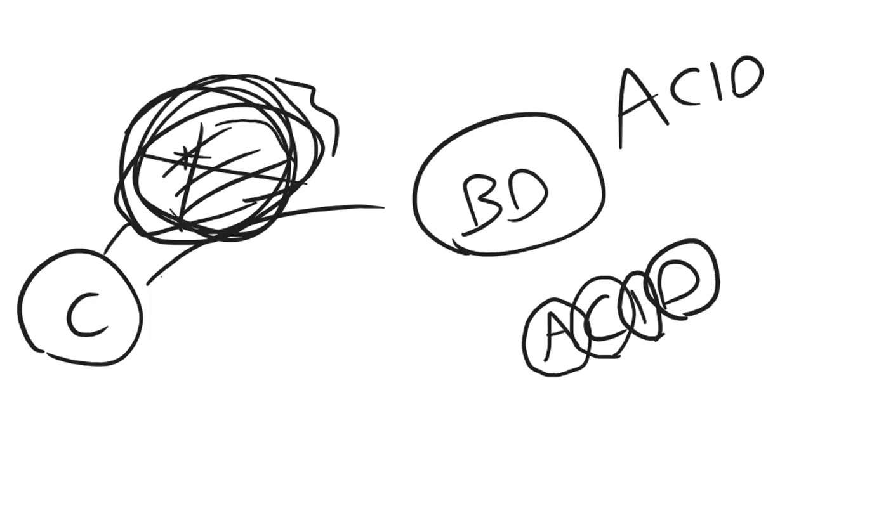

## Transacciones

Es lo que hace que una base de datos sea consistente. y se asegura de que todas las operaciones se ejecuten correctamente.
Si una de estas transacciones falla, se deshace todo lo que se hizo en la transaccion. Responde al ACID (Atomicidad, Consistencia, Aislamiento, Durabilidad).

Atomicidad: Todo o nada.
Consistencia: Todo debe quedar consistente.
Aislamiento: Aislado de las demas transacciones.
Durabilidad: Duradera, es decir, que se queda guardado en la base de datos.



Crear una transaccion:

```sql
USE store;

DROP PROCEDURE IF EXISTS TestTransaction;


DELIMITER $$
$$
CREATE PROCEDURE TestTransaction()

BEGIN
    START TRANSACTION;
        INSERT INTO city(name)
        VALUES ('Barcelona');
    COMMIT;
END$$

DELIMITER ;
```

ROLLBACK: es para deshacer la transaccion, retorna la informacion a su estado original.
COMMIT: es para confirmar la transaccion, es decir, que se queda guardado en la base de datos.

Para probar la transaccion:

```sql
CALL TestTransaction();
```

Manejo de errores en transacciones:

SE hace uso de DECLARE EXIT HANDLER FOR SQLEXCEPTION, que es un manejador de errores que se ejecuta cuando ocurre un error.

```sql
USE store;

DROP PROCEDURE IF EXISTS TestTransaction;


DELIMITER $$
$$
CREATE PROCEDURE TestTransaction()

BEGIN

    DECLARE EXIT HANDLER FOR SQLEXCEPTION
    BEGIN
        ROLLBACK;
        SELECT 'Error al ejecutar la transaccion';
    END;
    START TRANSACTION;
        INSERT INTO city(name)
        VALUES ('A');


        INSERT INTO city(name)
        VALUES ('A');
    COMMIT;
END$$

DELIMITER ;
```

```sql
USE store;

DROP PROCEDURE IF EXISTS TestTransaction;


DELIMITER $$
$$
CREATE PROCEDURE TestTransaction()

BEGIN

    DECLARE EXIT HANDLER FOR SQLEXCEPTION
    BEGIN
        ROLLBACK;
        SELECT 'Error al ejecutar la transaccion';
    END;
    START TRANSACTION;
        INSERT INTO city(name)
        VALUES ('A');


        --INSERT INTO city(name)
        --VALUES ('A');
    COMMIT;
END$$

DELIMITER ;
```
