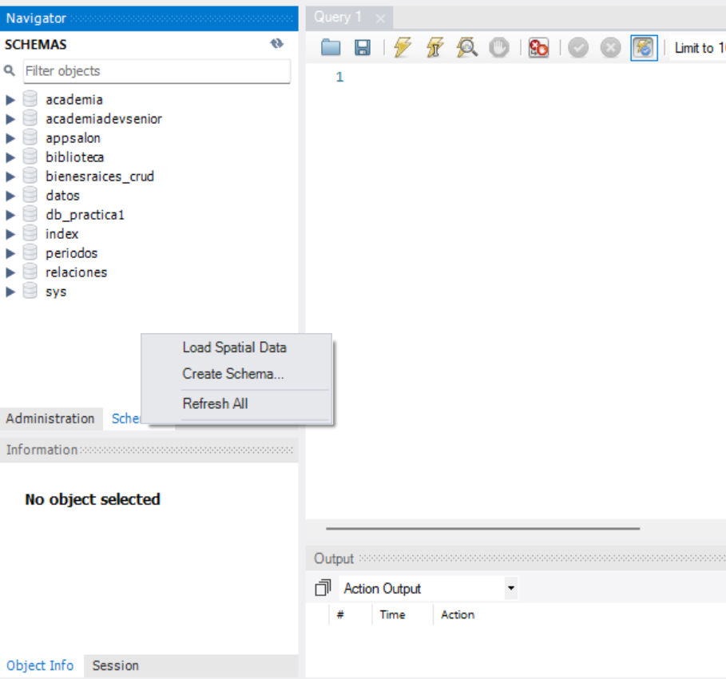
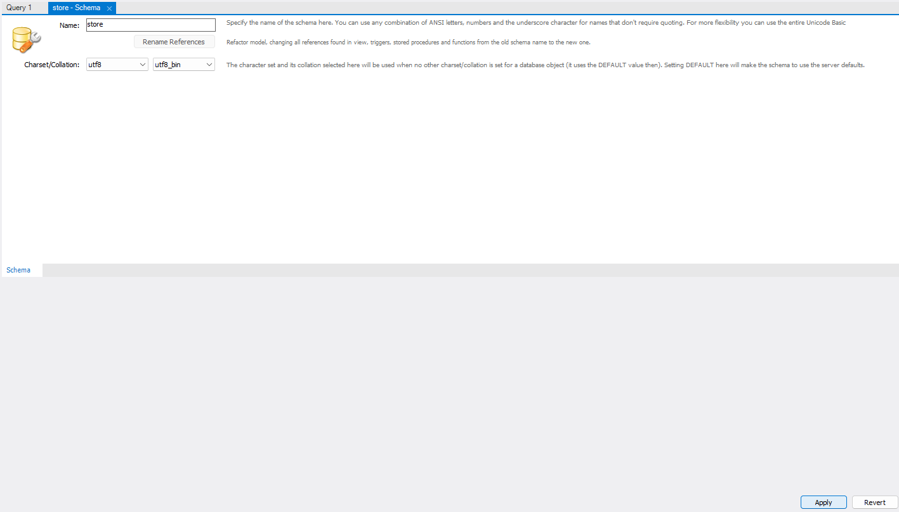
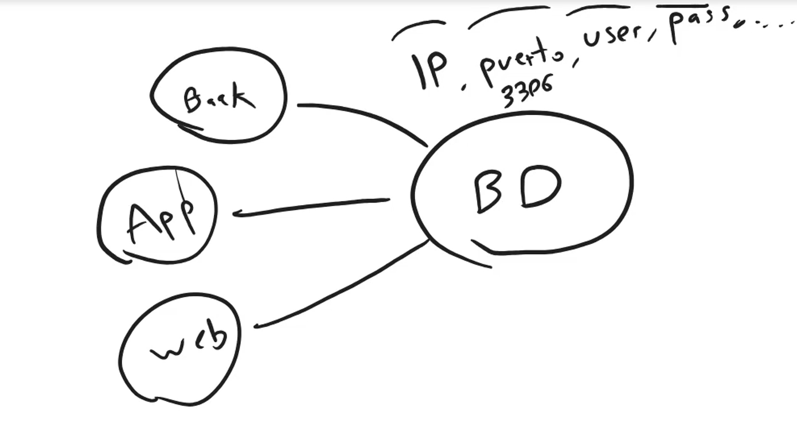
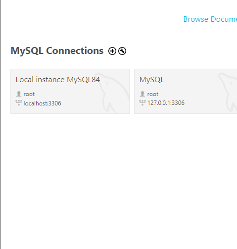
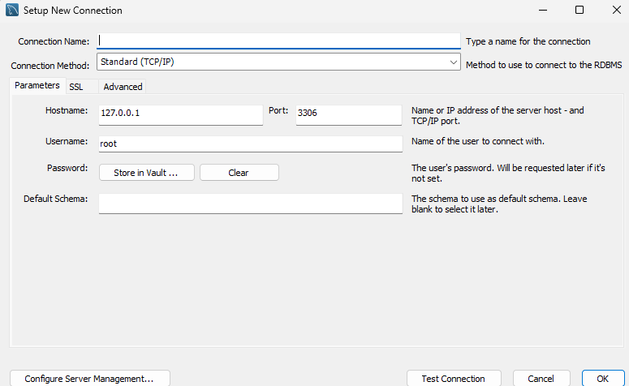
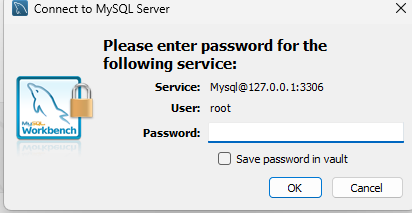

## Creación de una base de datos

La base de datos y el schema en MySQL son lo mismo.

Una base de datos es:
Una entidad que tiene una coleccion de tablas, estas tablas tienen relaciones entre ellas. Esta información debe estar normalizada.

Para crear un schema en MySQL Workbench se debe hacer lo siguiente:

Damos click derecho y seleccionamos "Create Schema".


Y luego la nombramos y seleccionamos la codificación utf8 deseada.


El codigo equivalente en sql para crear la tabla es:

```sql
CREATE SCHEMA `store` DEFAULT CHARACTER SET utf8 COLLATE utf8_bin ;
```

Y para seleccionar la base de datos se debe hacer lo siguiente:

```sql
USE `store`;
```

### Conexión a la base de datos

Para poder conectarse a la base de datos se requieren datos especificos para conectarse a ella:

- El host: Es el servidor donde se encuentra la base de datos. En este caso es localhost.

- El puerto(PORT): Es el puerto por el que se conecta a la base de datos. En este caso es 3306.

- El usuario(USER): Es el usuario que se encarga de la base de datos. En este caso es root

- La contraseña(PASSWORD): Es la contraseña que se le da al usuario root para conectarse a la base de datos. En este caso es Hector2022



Para conectarse a la base de datos desde workbench se debe hacer lo siguiente:

Damos click derecho y seleccionamos "Connect to Database", que es el simbolo de mas.



Y luego pasamos los datos requeridos para conectarnos a la base de datos, como el host, el puerto, el usuario y la contraseña. Debemos nombrar la conexión en Connection Name.



Luego pasar la contraseña del usuario root.


### Seleccionar la base de datos

Para seleccionar la base de datos se debe hacer lo siguiente:

```sql
USE `store`;
```

Crear una tabla en sql:

```sql
CREATE TABLE customer (
    id INT AUTO_INCREMENT PRIMARY KEY,
    name VARCHAR(100) NOT NULL
);
```

- AUTO_INCREMENT: Es un atributo que se encarga de incrementar el valor de la columna id en 1 cada vez que se inserta un nuevo registro.
- PRIMARY KEY: Es un atributo que se encarga de identificar de forma única a cada registro.
- NOT NULL: Es un atributo que se encarga de indicar que la columna no puede tener valores nulos.
- VARCHAR: Es un atributo que se encarga de indicar que la columna es de tipo cadena de caracteres (cantidad de caracteres a usar ).
- INT: Es un atributo que se encarga de indicar que la columna es de tipo entero.

- Modificar las tablas:

Modificar la tabla customer:

```sql
ALTER TABLE customer ADD COLUMN email VARCHAR(100) NOT NULL;
```

- ALTER TABLE: Es un atributo que se encarga de modificar la tabla.
- ADD COLUMN: Es un atributo que se encarga de agregar una nueva columna a la tabla.
- VARCHAR: Es un atributo que se encarga de indicar que la columna es de tipo cadena de caracteres (cantidad de caracteres a usar ).
- NOT NULL: Es un atributo que se encarga de indicar que la columna no puede tener valores nulos.

Añadir un campo nuevo para phone:

```sql
ALTER TABLE customer ADD COLUMN phone VARCHAR(20) NOT NULL;
```

- Eliminar un campo o una columna:

```sql
ALTER TABLE customer DROP COLUMN phone;
```

- Modificar un campo o una columna:

```sql
ALTER TABLE customer MODIFY COLUMN email VARCHAR(200) NOT NULL;
```

- Esto modifica la columna email para que tenga un maximo de 200 caracteres.

Eliminar una tabla:

- Creamos una tabla de pruebas:

```sql
CREATE TABLE something(
    id INT AUTO_INCREMENT PRIMARY KEY,
    name VARCHAR(100) NOT NULL
);
```

- Eliminamos la tabla:

```sql
DROP TABLE something;
```

- DROP TABLE: Es un atributo que se encarga de eliminar una tabla.
