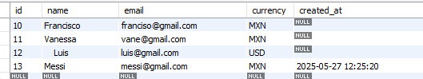
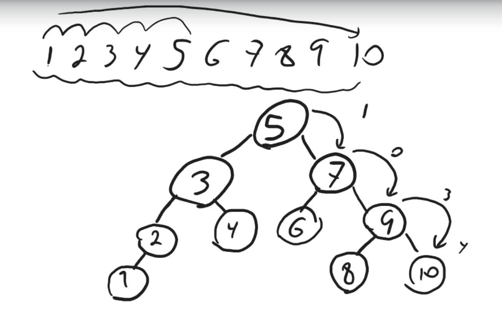
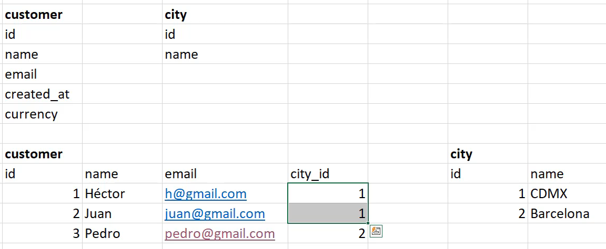

## Constraints

Los constraints son reglas que se aplican a las tablas para garantizar la integridad de los datos.

Existen varios tipos de constraints:

- Primary Key: Define una clave primaria, que es un identificador único para cada registro.
- Foreign Key: Define una clave externa, que es una clave primaria de otra tabla.
- Not Null: Define que un campo no puede ser nulo.
- Unique: Define que un campo debe ser único.
- Check: Define una condición que debe cumplirse.
- Default: Define un valor por defecto para un campo.


### Primary key

```sql

CREATE TABLE city(
	id INT AUTO_INCREMENT PRIMARY KEY,
    name VARCHAR(50) 
);
```
- Utiliza el constraint primary key para definir la clave primaria, que por si mismo ya tiene dos constraint, que son not null y unique. Ya que no puede haber dos registros con el mismo id y no puede ser nulo.


### NOT NULL


- NULL: es un valor que indica que un campo no tiene valor ausencia de valor.
- Por el ejemplo del nombre de la ciudad no puede ser null ya que es un campo obligatorio.

```sql
ALTER TABLE city
CHANGE COLUMN
name
name  VARCHAR(50) NOT NULL;
```
- Modifica la tabla city y cambia el campo name para que no pueda ser null.

### UNIQUE

- UNIQUE: Define que un campo debe ser único.

```sql
ALTER TABLE city
ADD UNIQUE (name);
```
- Modifica la tabla city y agrega el constraint unique al campo name.

### DEFAULT

- DEFAULT: Define un valor por defecto para un campo.

```sql
ALTER TABLE customer
ADD COLUMN currency varchar(3) DEFAULT 'MXN';
```
- Modifica la tabla customer y agrega el constraint default al campo currency.

```sql
INSERT INTO customer(name, email)
VALUES('Vanessa', 'vane@gmail.com');
```
- Al insertar un registro en la tabla customer, si no se especifica el valor de currency, se usara el valor por defecto 'MXN'.

Cuando se manda un valor en el DEFAULT, toma el prioridad sobre el valor por defecto.

```sql
INSERT INTO customer(name, email, currency)
VALUES('    Luis', 'luis@gmail.com', 'USD');
```
- Al insertar un registro en la tabla customer, si se especifica el valor de currency, se usara el valor especificado. Por lo que no se usara 'MXN', sino 'USD'.

```sql
ALTER TABLE customer 
ADD COLUMN created_at DATETIME;
```
- Modifica la tabla customer y agrega el constraint default al campo currency.

```sql
ALTER TABLE customer 
MODIFY COLUMN created_at TIMESTAMP DEFAULT CURRENT_TIMESTAMP;
```
- Modifica la tabla customer y agrega el constraint default al campo currency.




### INDEX

El indice es una estructura de datos que permite buscar registros en una tabla de forma rapida. Guarda esta información en un arbol binario de busqueda equilibrado.
Un arbol binario de busqueda equilibrado es un arbol binario de busqueda donde la altura de los subarboles izquierdo y derecho es la misma.


```sql
CREATE INDEX idx_name ON customer(name);
```
- Solo usarlos al ser necesarios, ya que pueden ser costosos de mantener, al insertar, actualizar y eliminar registros.

```sql
ALTER TABLE customer
DROP INDEX idx_name;
```
- Elimina el indice idx_name de la tabla customer.


### CHECK

- CHECK: Define una condición que debe cumplirse.

```sql
ALTER TABLE customer
ADD CONSTRAINT check_name CHECK (name <> 'abc');
```
- Modifica la tabla customer y agrega el constraint check al campo name, donde no puede ser 'abc' el nombre.

```sql
INSERT INTO customer(name, email)
VALUES('abc', 'abc@gmail.com');
```
- Al insertar un registro en la tabla customer, si se especifica el valor de name como 'abc', se generara un error.

Mostrar el codigo de creacion de la tabla customer.
```sql
SHOW CREATE TABLE customer;
```
Permite ver los constraints de la tabla customer y caracteristicas de la tabla adicionalmente.

```sql
ALTER TABLE customer
DROP CONSTRAINT check_name;
```
- Elimina el constraint check_name de la tabla customer. No puedo crear constraint para datos que ya existen, dentro de la tabla.

### FOREIGN KEY

- FOREIGN KEY: Define una clave externa, que es una clave primaria de otra tabla. Con esto se garantiza que los datos de la tabla externa existan en la tabla principal, para poder relacionarlas.



Para llevar a cabo esta relacion, se debe crear una clave primaria en la tabla principal y una clave externa en la tabla secundaria.

```sql
ALTER TABLE customer
ADD COLUMN city_id INT;
```
- Modifica la tabla customer y agrega el constraint foreign key al campo city_id.

```sql
ALTER TABLE customer
ADD CONSTRAINT fk_city 
FOREIGN KEY (city_id) REFERENCES city(id);
```
- Modifica la tabla customer y agrega el constraint foreign key al campo city_id.

```sql
INSERT INTO customer(name, email, city_id)
VALUES('maria', 'maria@gmail.com', 1);
```
- Al insertar un registro en la tabla customer, si se especifica el valor de city_id como 1, se generara un error.

- Los forign key, permite mantener la integridad referencial de los datos. Pero igual al tener muchos datos los cuales se relacionan, puede ser costoso de mantener, al insertar, actualizar y eliminar registros, debido a que se debe verificar que los datos existan en la tabla principal.
