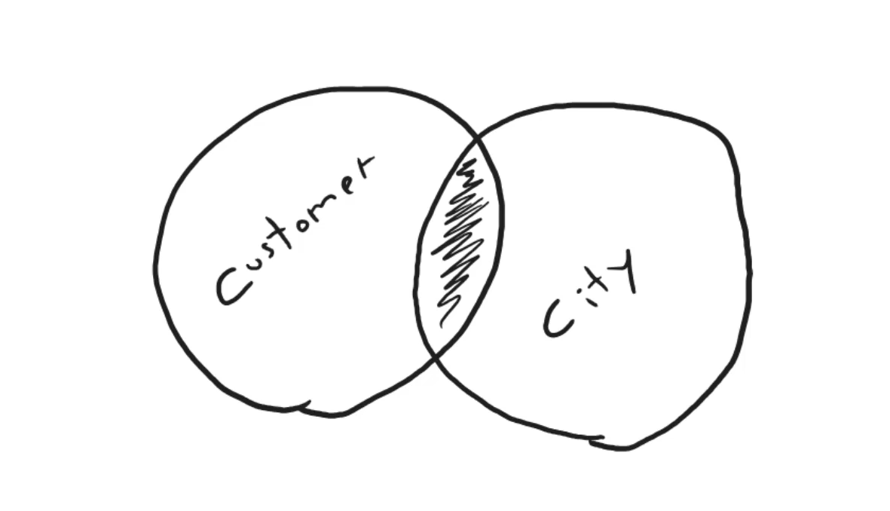
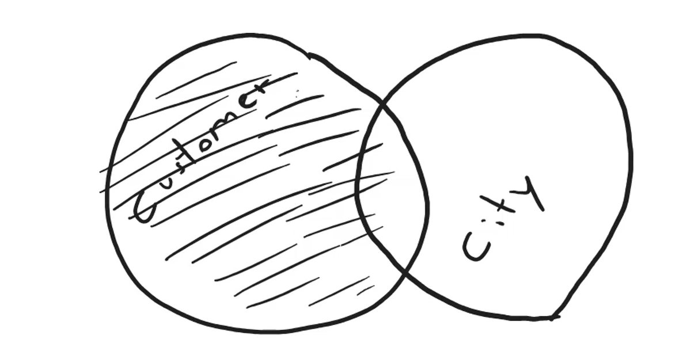
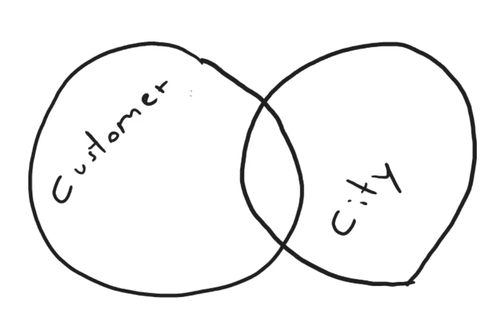
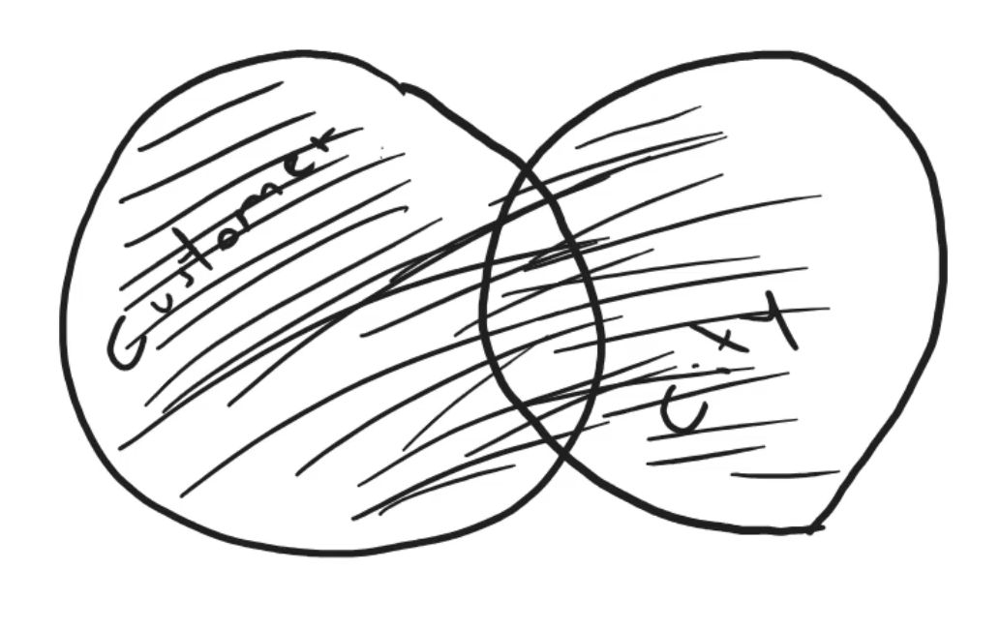

### INNER JOIN

Tenemos dos tablas la de customer y la de city, la tabla customer tiene una columna que se llama city_id que es una foreign key que se refiere a la tabla city.

Entonces si queremos traer todos los clientes y su ciudad, podemos usar el INNER JOIN.
El inner join es un tipo de join que nos traera todos los registros que coincidan en ambas tablas.



```sql
SELECT * FROM customer 
INNER JOIN city ON city.id = customer.city_id;
```

- La consulta anterior nos traera todos los registros de la tabla customer y la tabla city que coincidan en la columna city_id.


```sql
SELECT customer.name, city.name FROM customer 
INNER JOIN city ON city.id = customer.city_id;
```

- La consulta anterior nos traera todos los registros de la tabla customer y la tabla city que coincidan en la columna city_id, pero solo las columnas que se seleccionaron en la consulta customer.name y city.name.

```sql
SELECT customer.name, c.name FROM customer 
INNER JOIN city as c ON c.id = customer.city_id;
```
- En la consulta anterior, la tabla city se le dio un alias c para que no se repita el nombre de la tabla.

### LEFT JOIN

El left join es un tipo de join que nos traera todos los registros de la tabla de la izquierda y los registros de la tabla de la derecha que coincidan en la columna que se indique.


```sql
SELECT customer.name, c.name FROM customer 
LEFT JOIN city as c ON c.id = customer.city_id;
```

- La consulta anterior nos traera todos los registros de la tabla customer y la tabla city que coincidan en la columna city_id, pero solo las columnas que se seleccionaron en la consulta customer.name y city.name.

```sql
SELECT customer.name, IFNULL(c.name, 'sin ciudad') FROM customer 
LEFT JOIN city as c ON c.id = customer.city_id;
```

- La consulta anterior nos traera todos los registros de la tabla customer y la tabla city que coincidan en la columna city_id, pero solo las columnas que se seleccionaron en la consulta customer.name y city.name. La funcion IFNULL es una funcion que nos permite reemplazar un valor NULL por otro valor, por lo que si no hay una ciudad para un cliente, se mostrara 'sin ciudad'.

### RIGHT JOIN

El right join es un tipo de join que nos traera todos los registros de la tabla de la derecha y los registros de la tabla de la izquierda que coincidan en la columna que se indique.



```sql
SELECT customer.name, c.name FROM customer 
RIGHT JOIN city as c ON c.id = customer.city_id;
```

- La consulta anterior nos traera todos los registros de la tabla city y la tabla customer que coincidan en la columna city_id, pero solo las columnas que se seleccionaron en la consulta customer.name y city.name.

### CROSS JOIN

El cross join es un tipo de join que nos traera todos los registros de la tabla de la izquierda y la tabla de la derecha.

```sql
SELECT * FROM customer 
CROSS JOIN city;
```

- La consulta anterior nos traera todos los registros de la tabla customer y la tabla city, de forma que cada registro de la tabla customer se combinará con cada registro de la tabla city.

### UNION

Sirve para unir dos consultas SELECT.

```sql
SELECT id, customer.name FROM customer 
UNION 
SELECT 'uno mas', 'algo mas';
```

- La consulta anterior realiza la union de dos consultas SELECT, la primera consulta selecciona la columna id y customer.name de la tabla customer, la segunda consulta selecciona 'uno mas' y 'algo mas'.

```sql
SELECT id, name
FROM customer
UNION
SELECT id, name
FROM city;
```

- La consulta anterior realiza la union de dos consultas SELECT, la primera consulta selecciona la columna id y name de la tabla customer, la segunda consulta selecciona la columna id y name de la tabla city.

### SELF JOIN

El self join es un tipo de join que nos traera todos los registros de la tabla de la izquierda y la tabla de la derecha que coincidan en la columna que se indique.

- Añadimos una colunmna nueva a la tabla customer que se llama referred_id que es una foreign key que se refiere a la tabla customer.

```sql

ALTER TABLE customer
ADD COLUMN referred_id INT;
```


```sql
ALTER TABLE customer
ADD CONSTRAINT fk_referred
FOREIGN KEY (referred_id)
REFERENCES customer(id);
```
- Añadimos una constraint que nos permite que la columna referred_id sea una foreign key que se refiere a la tabla customer.

```sql
UPDATE customer SET referred_id = 1
WHERE id <> 1;
```
- Actualizamos la tabla customer para que la columna referred_id sea la id del cliente 1.


```sql
SELECT c1.name, IFNULL(c2.name, 'sin referido') as 'remondado' 
FROM customer as c1
INNER JOIN customer as c2
ON c2.id = c1.referred_id;
```
- La consulta anterior nos traera todos los registros de la tabla customer y la tabla customer que coincidan en la columna referred_id, pero solo las columnas que se seleccionaron en la consulta customer.name y customer.name. Basicamente trae el customer y el customer que lo referio. La funcion IFNULL es una funcion que nos permite reemplazar un valor NULL por otro valor, por lo si no hay un customer que lo referio, se mostrara 'sin referido'.


### FULL JOIN

El full join es un tipo de join que nos traera todos los registros de la tabla de la izquierda y la tabla de la derecha que coincidan en la columna que se indique.



```sql
SELECT customer.name, city.name FROM customer 
LEFT JOIN city ON city.id = customer.city_id
UNION
SELECT customer.name, city.name FROM customer 
RIGHT JOIN city ON city.id = customer.city_id;
```