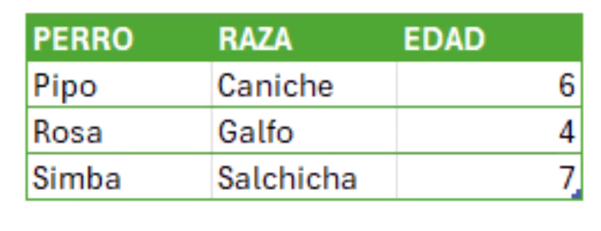
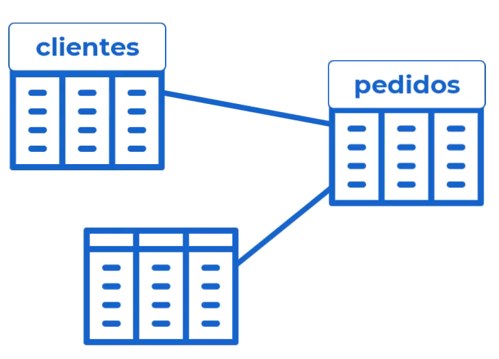
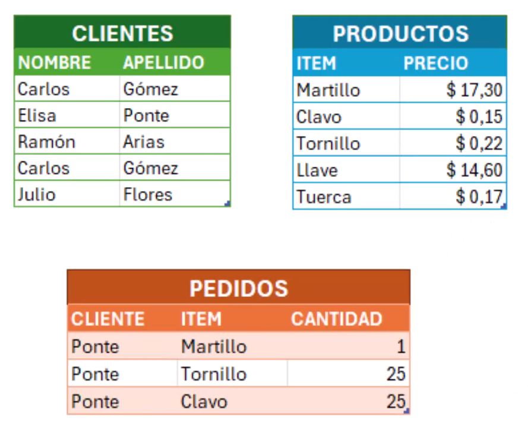
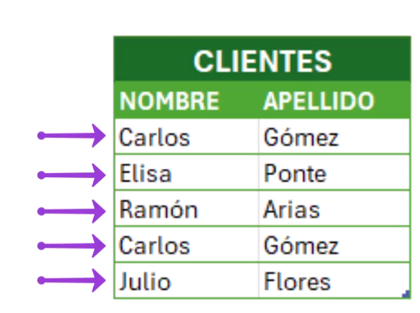
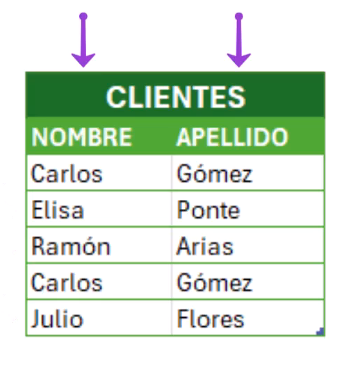
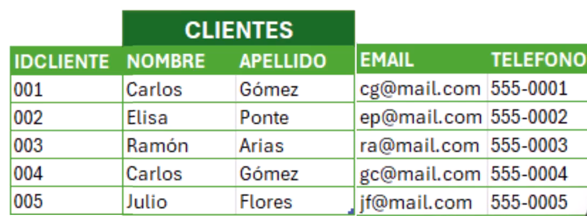
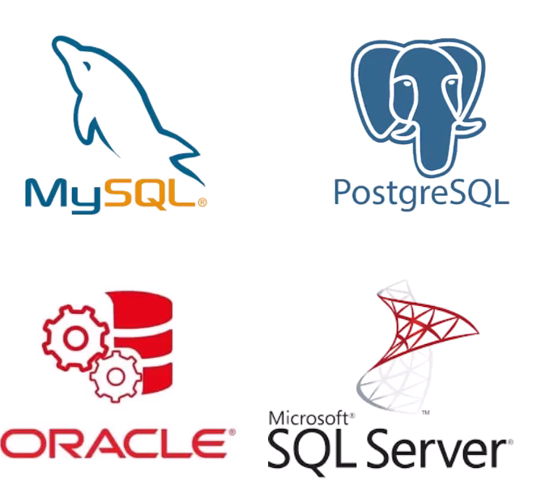

## Base de datos:

Una base de datos es un sistema organizado para almacenar, gestionar y recuperar información de manera eficiente. Aquí tienes los puntos clave:

1. Almacenamiento estructurado: Los datos se guardan de forma organizada, típicamente en tablas con filas y columnas.
2. Gestión centralizada: Permite a múltiples usuarios acceder y modificar la información de manera controlada.
3. Relaciones entre datos: Puede establecer conexiones lógicas entre diferentes conjuntos de datos.
4. SGBD (Sistema de Gestión de Bases de Datos): Software que facilita la creación, mantenimiento y uso de bases de datos (ejemplos: MySQL, PostgreSQL, SQL Server).
5. Lenguaje SQL: Se utiliza para interactuar con las bases de datos relacionales.
6. Ventajas:

- Reducción de redundancia
- Mayor integridad de datos
- Acceso concurrente controlado
- Seguridad en el acceso a la información

En resumen una base de datos es **una colección de datos organizados de manera estructurada**.

### Lenguaje de consulta estructurada (SQL):

SQL (Structured Query Language) es un lenguaje estructurado de programación diseñado específicamente para gestionar y operar en bases de datos relacionales. Aquí están los puntos clave:

1. Consultas: Permite buscar y recuperar datos de manera eficiente.
2. Operaciones CRUD: Crear, Leer, Actualizar y Eliminar registros.
3. Transacciones: Permiten realizar operaciones complejas de manera segura y coherente.
4. Indexación: Acelera las búsquedas mediante la creación de índices.

```SQL
SELECT  titulo FROM Libros WHERE genero = 'Historia';
```

Todas las operaciones que se realizaran en sql, son consultas.

- QUIZ:

¿Que significa SQL?
SQL significa Structured Query Language (Lenguaje de Consulta Estructurada).

¿Cuál es el propósito principal de SQL?
Administrar Bases de Datos Relacionales

¿Por qué es importante aprender SQL hoy en día?
Todos los gestores de base de datos relacionales utilizan SQL como lenguaje de consulta.

¿Por qué decimos que SQL es un lenguaje "estructurado"?
Porque tiene reglas claras y precisas para hacer consultas.

### Definicion de una base de datos informatica

Una base de datos informatica es una colección de datos organizados de manera estructurada. Tablas, filas y columnas. Es un lugar digital donde guardamos datos de forma estructurada para poder acceder a ellos de manera rapida y eficiente.



La tabla anterior es una base de datos, porque la informacion esta organizada de manera estructurada en filas y columnas. Nos permite almacenar gestionar y recuperar datos para algunas tareas basicas.

Las base de datos se pueden dividir en dos tipos:

1. Bases de datos relacionales (RDBMS): Utilizan tablas con filas y columnas para organizar los datos. Se llaman relacionales porque los datos(las tablas) se relacionan entre si.



2. Bases de datos No relacionales (NoSQL): Utilizan diferentes estructuras para organizar los datos. Menos estructuradas y muy flexibles.

- QUIZ:

¿Cuál de las siguientes es la mejor definición de "base de datos"?

Una colección organizada de datos, diseñada para ser eficiente en el acceso y recuperación de datos, confiable y segura.

¿Qué tipo de base de datos son las que contienen tablas relacionadas entre sí?

Bases de datos relacionales (RDBMS)

Las Bases de Datos No Relacionales (o NoSQL), son aquellas que...

son bases menos estructuradas y por lo tanto mucho más flexibles.

¿Qué tipo de Bases de Datos usaremos siempre en este curso sobre SQL?

Bases de datos relacionales (RDBMS)

## Componentes de una base de datos:

1. Tablas: Son las estructuras fundamentales que almacenan los datos organizados en filas y columnas. Son el componete basico de una base de datos.



2. Filas: Representan registros individuales dentro de una tabla, cada una con sus propios valores para las columnas. Son los registros de cada caso, es decir, cada fila representa en una tabla de clientes, un cliente.
   

3. Columnas: Definen los campos o atributos que componen cada registro, como nombres, precios, etc. En el caso de la tabla de clientes, las columnas serian el nombre, apellido, etc. Es una propiedad de los registros.
   

4. Clave primaria: Un identificador único que distingue cada fila de la tabla. Un campo que identifica cada fila en una tabla.
   

5. Clave foránea: Un valor que establece una relación entre tablas, permitiendo referencias entre ellas.

6. Índices: Estructuras que aceleran las búsquedas y consultas en la base de datos.

- Quiz:

¿Cuáles son los principales componentes de una Base de Datos Relacional?

Tablas, filas, columnas, clave primaria.

Las tablas son el componente principal de una base de datos
Verdadero

¿Con qué otro nombre nos referimos a las columnas de una tabla?
Campos

¿Para qué sirven las claves principales de una tabla?
Para identidicar de manera única cada registro de una tabla.

## Sistema de Gestión de Bases de Datos (SGBD):

Un Sistema de Gestión de Bases de Datos (SGBD) es un software que facilita la creación, mantenimiento y uso de bases de datos.

DBMS (Database Management System) es un Sistema de Gestión de Bases de Datos, es un programa de gestión de base de datos, que actua de intermediario entre la base de datos y el usuario, para crear, modificar y gestionar la base de datos.



- QUIZ

¿Con qué sigla nos referimos a los Sistemas de Gestión de Bases de Datos?

DBMS (Database Management System)

¿Qué función cumple un Sistema de Gestión de Bases de Datos (DBMS)?

Actua como intermediario entre la base de datos y el usuario, para crear, modificar y gestionar la base de datos.

¿Qué DBMS usaremos en este curso?
MySQL

En la metáfora de la biblioteca como una base de datos ¿Qué rol ocupa el DBMS?
El bibliotecario

## MySQL y MySQL Workbench:

- MySQL: Motor de gestión de base de datos.
- MySQL Workbench: es una herramienta visual y un entorno integrado de desarrollo.

4 motivos para usar mysql:

1. Accesibilidad: Siendo de cógigo abierto, esta disponible para todos de forma gratuita.
2. Popularidad: Existe abundancia de recursos de aprendizaje, foros de soporte y documentación.
3. Compatibilidad: MySQL es compartible con todos los sistemas operativos principales, incluyendo Windows, Linux y macOS.
4. Fundamentos transferibles: Las habilidades que adquieras serán transferibles a otros sistemas de gestón de base de datos.

- MySQL: Sistema de Gestión de Bases de Datos.
- MySQL Workbench: es una herramienta de administración de base de datos.

-QUiz:

¿Cuál es una de las principales razones para elegir MySQL como sistema de gestión de bases de datos?

Es de cógigo abierto y gratis.

¿Cómo beneficia la popularidad de MySQL a sus usuarios?

Proporcionado una vasta comunidad de soporte y recursos.

¿Qué asegura la compatibilidad de MySQL con varios lenguajes de programación?

Desarrollo de aplicaciones dinámicas y flexibles.

¿Qué proporciona aprender MySQL además de habilidades en gestión de bases de datos?

Una base sólida transferible a otros sistemas de gestón de base de datos.

## Diseñar de forma conceptual la primera base de datos:

Tener tres tablas de una base de datos , deseada. Las tablas deben estar relacionadas.

Tabla equipos

| ID  | Nombre  | Etiqueta  | NFC    | idDetalle |
| --- | ------- | --------- | ------ | --------- |
| 1   | Taladro | SMART1001 | 181096 | 1         |
| 2   | Cutter  | SMART1002 | 181097 | 2         |
| 3   | Pinza 1 | SMART1001 | 181098 | 3         |

Tabla detalle
| ID | Marca | Cantidad | Creacion |
|----|--------|----------|------------|
| 1 | Trupper| 2 | 12/10/2025 |
| 2 | Trupper| 3 | 08/10/2025 |
| 3 | Bosh | 1 | 24/10/2025 |

Tabla usuarios
| ID | Nombre | Apellido | idDetalle |
|----|--------|----------|-----------|
| 1 | Jose Angel| Balbuena Palma | 1 |
| 2 | Alexander | Badillo | 2 |
| 3 | Jorge | Rojas | 3 |

Tabla detalle usuarios
| ID | Edad | Matricula | Targeta | Programa |
|----|--------|----------|-----------|-----------|
| 1 | 28 | L03533767 | 181094 | IMT |
| 2 | 23 | L03533761 | 181094 | IMT |
| 3 | 36 | L03533762 | 181092 | IMT |

Tabla prestamos
| ID | idUsuario | idEquipo | Fecha | Cantidad |Estado |
|----|---------|----------|-----------|-----------|---------|
| 1 | 1 | 2 | 12/10/2025 | 2 | 1 |
| 2 | 1 | 2 | 12/10/2025 | 2 | 0 |
