## Instalación de MySql y MySQL Workbench

Debemos ir a la pagina web de mysql:

```
https://www.mysql.com/
```


Y descargamos el instalador de MySQL.


Y seleccionamos el MySQL for Windows (x64),

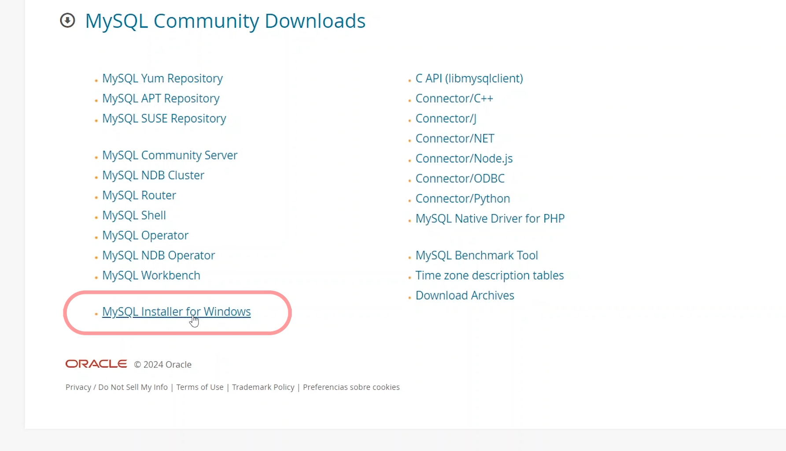

Vamos a descargar el instalador que pesa cerca de 296 MB.
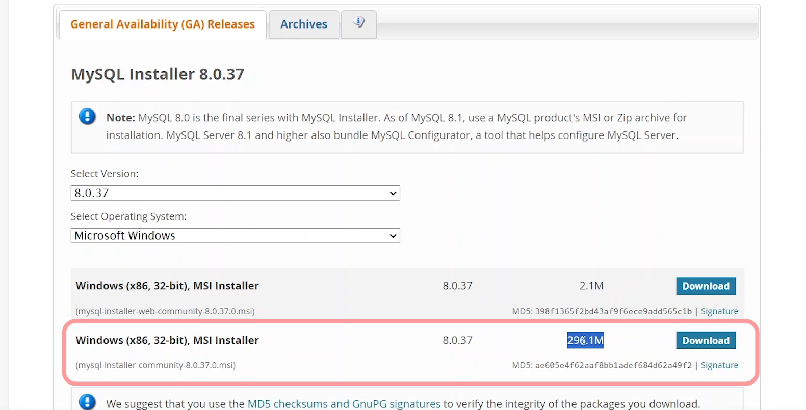


Para ejecutar el instalador, debemos darle permisos de administrador y decir que si a todo.

Una vez abierto el instalador, selccionamos la opcion de instalación personalizada.
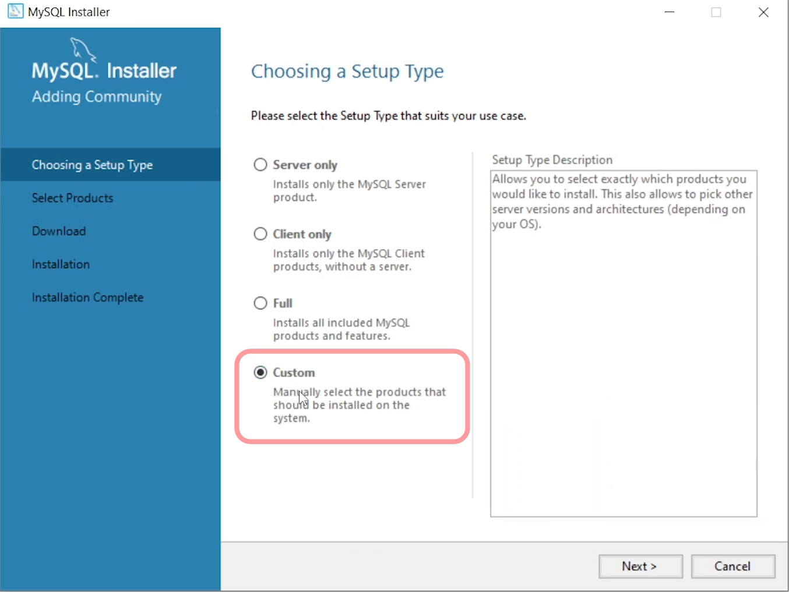

Los productos que debemos seleccionar en la instalación es MySQL Server y MySQL Workbench, donde el primero es el motor de base de datos y el segundo es la herramienta para gestionar la base de datos, despues de seleccionarlos, damos siguiente.


Despues le damos click en ejecutar.
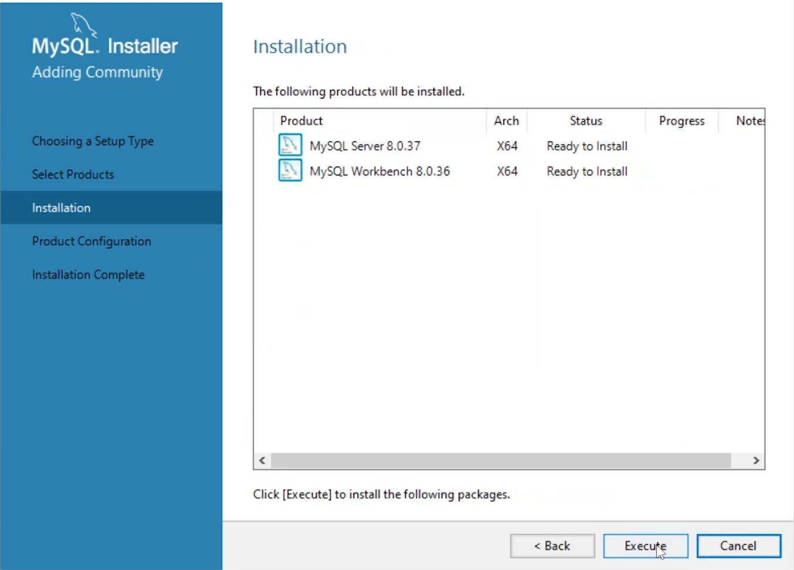

Presionamos siguiente y siguinete, hasta que aparezca la pantalla de Type and Network. Donde configuramos de la siguiente forma la conección de red y damos siguiente.
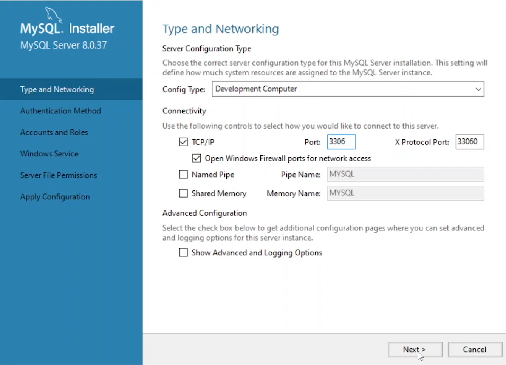

Utilizamos el tipo de encriptacion fuerte.
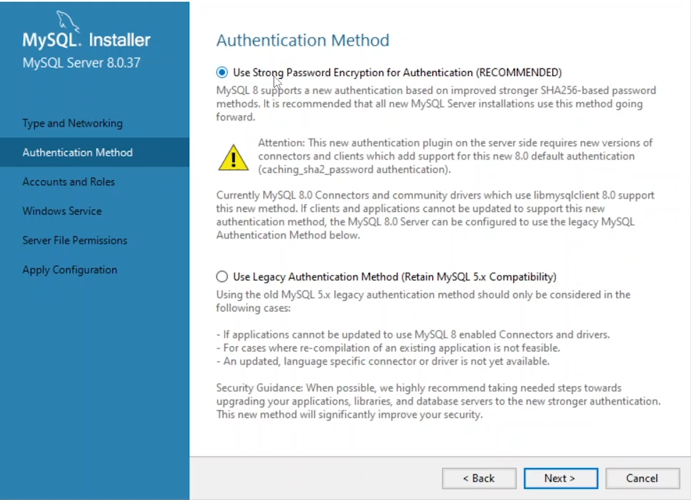

Despues configuramos el usuario root y la contraseña, en mi caso es **root** y damos siguiente.


Mantenemos la configuración estandar del servicio de windows y damos siguiente.
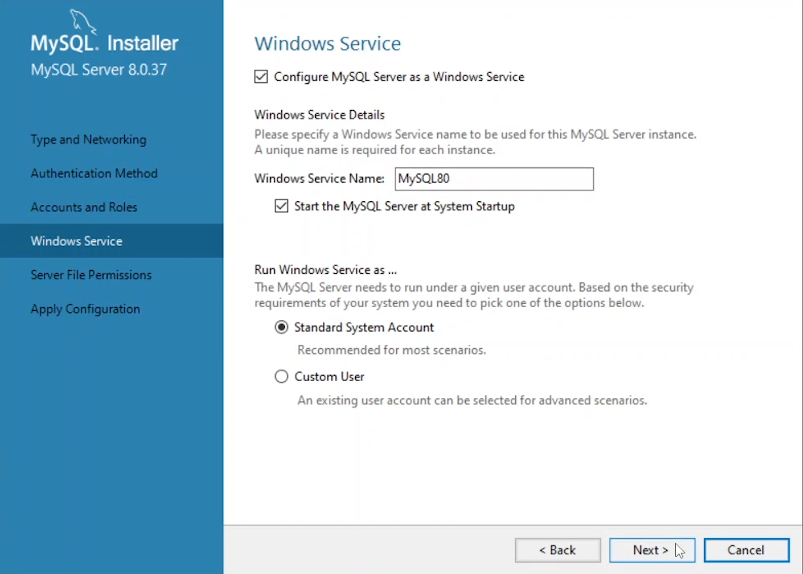

Garantizamos el full acceso al usuario root y damos siguiente.


Una vez completado el proceso de instalación, se muestra la siguiente pantalla.


Al dar click en finish, se muestra la siguiente pantalla, donde ya podemos iniciar la base de datos.
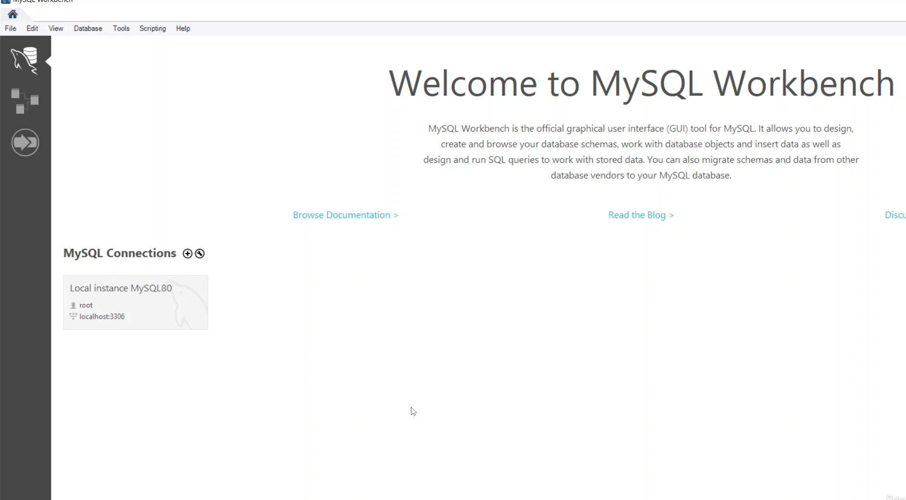

## Primeros pasos con MySQL Workbench

Se puede seleccionar la instancia local para conectarnos al motor de base de datos local.

En la coneccion de servidor, se muestra la siguiente pantalla, donde de lado derecho se encuentra la pestaña de administración, donde nos viene informacion del servidor.


El la opcion de Server Status se encuentra el estado del servidor, si esta corriendo o no.


Gestionar usuarios y permisos de los usuarios.
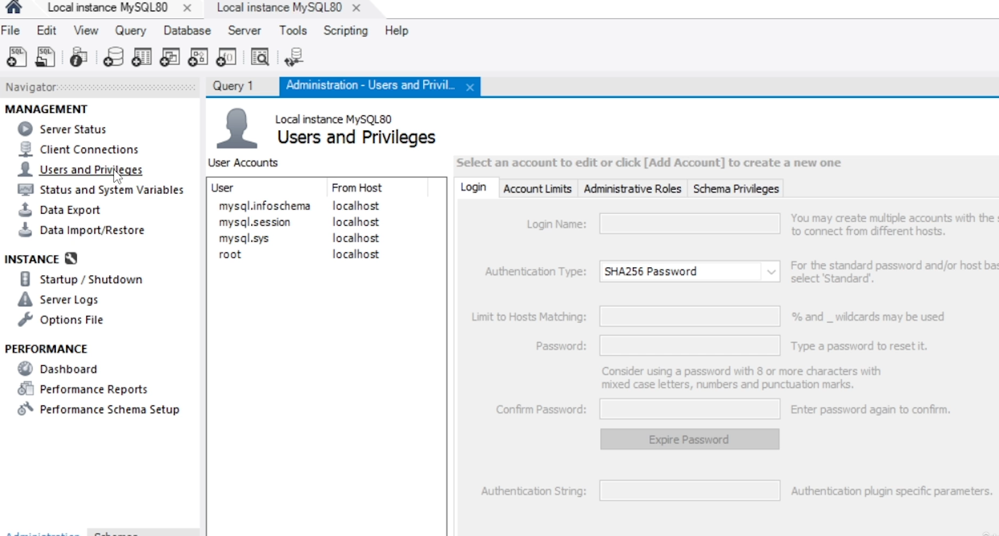

La opción de data export, nos ayuda a guardar la informacion de la base de dtos en un archivo .sql:
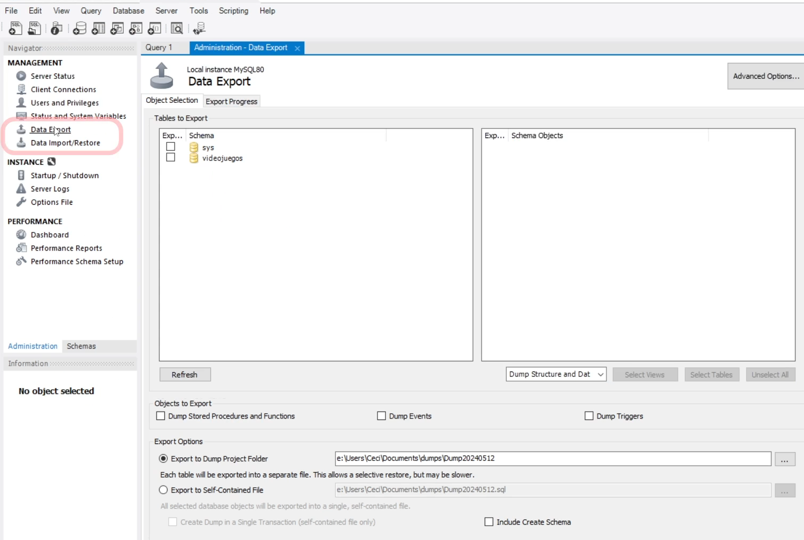

En la seccion de SCHEMAS, se encuentra la lista de las bases de datos que tenemos en el servidor. La base de datos es la coleccion de información, SYS es la base de datos por defecto.


La pestaña query es donde podemos escribir codigo sql.


- Quiz
  ¿Qué opción en MySQL Workbench te permite ver el estado actual del servidor MySQL?
  Server Status

En MySQL Workbench, ¿dónde puedes gestionar quién puede acceder al servidor MySQL y sus permisos?

Users and Privileges

¿Qué característica de MySQL Workbench se utiliza para hacer copias de seguridad de tus bases de datos?
Data Export

¿Qué opción NO es una función de la sección 'Server Status' en MySQL Workbench?

Ver el estado de la ejecución del servidor MySQL

¿Qué herramienta de MySQL Workbench te permite restaurar tus datos desde un archivo de respaldo?
Data Import

### Crea tu primera Base de Datos

Para el ejemplo practico crearemos una base de datos sencilla con 3 tablas.


Crear un nuevo schema o base de datos:

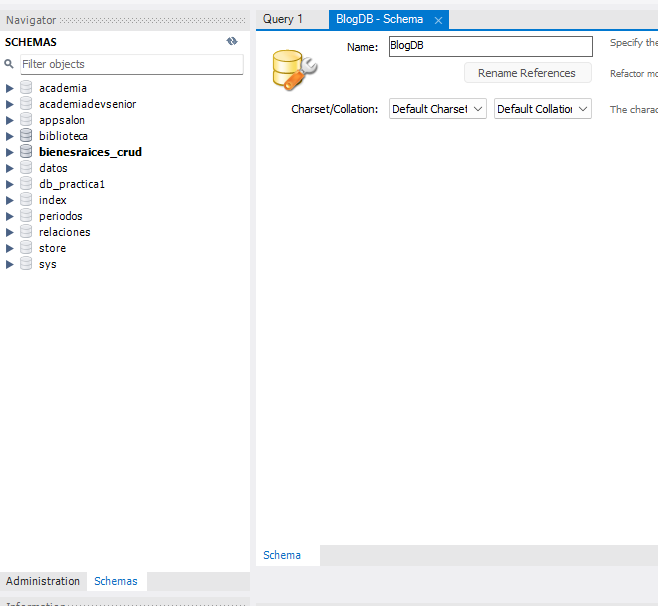

El codigo para crear una base de datos es el siguiente:

```sql
CREATE SCHEMA `blogdb` ;
```

Crear tablas en la base de datos:
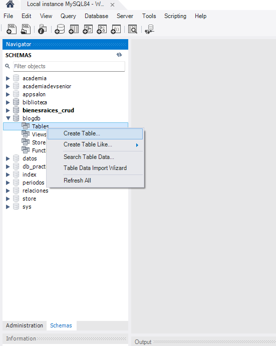

Configuramos la tabla de usarios que deseamos crear:
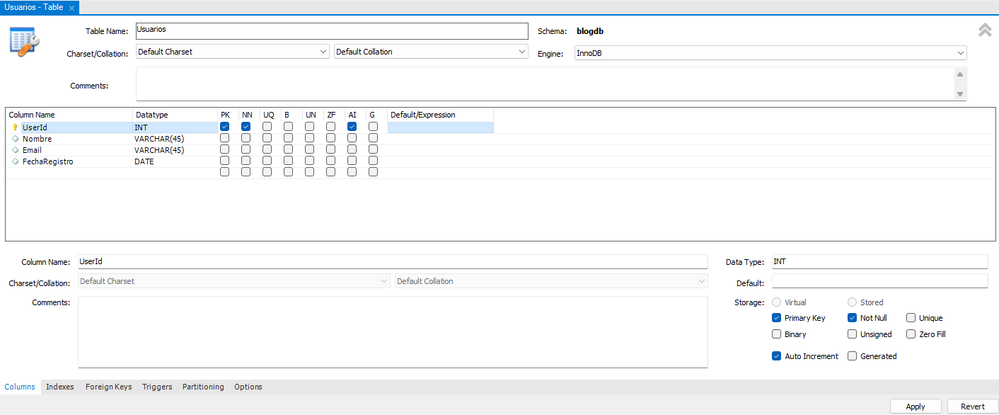

El código sql, para crear la tabla de usuarios es el siguiente:

```sql
CREATE TABLE `blogdb`.`usuarios` (
  `UserId` INT NOT NULL AUTO_INCREMENT,
  `Nombre` VARCHAR(45) NULL,
  `Email` VARCHAR(45) NULL,
  `FechaRegistro` DATE NULL,
  PRIMARY KEY (`UserId`));
```

Seleccionar la base de datos para crear la tabla.

```sql
USE blogdb;
SELECT * FROM usuarios;
```

Creamos la siguiente tabla de Publicaciones:
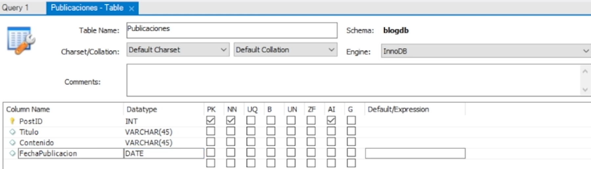

```sql
CREATE TABLE `blogdb`.`publicaciones` (
  `PostID` INT NOT NULL AUTO_INCREMENT,
  `Titulo` VARCHAR(45) NULL,
  `Contenido` VARCHAR(45) NULL,
  `FechaPublicacion` DATE NULL,
  PRIMARY KEY (`PostID`));

```

Creamos la tabla de los comentatios:

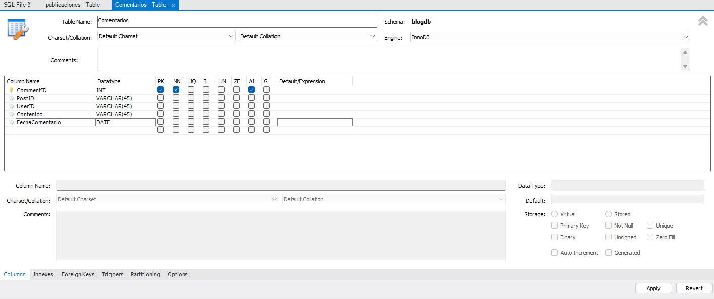

El query en sql para crear la tabla de los comentarios es el siguiente:

```sql
CREATE TABLE `blogdb`.`comentarios` (
  `CommentID` INT NOT NULL AUTO_INCREMENT,
  `PostID` VARCHAR(45) NULL,
  `UserID` VARCHAR(45) NULL,
  `Contenido` VARCHAR(45) NULL,
  `FechaComentario` DATE NULL,
  PRIMARY KEY (`CommentID`));
```

¿Qué es una clave foránea y para que sirve?

Una clave foránea es una columna o un conjunto de columnas en una tabla cuyos valores corresponde a los valores de la clave primaria de otra tabla. Para poder añadir una fila con un valore de clave foránea específico, debe existir una fila en la tabla relacionada con el valor de la clave primaria.

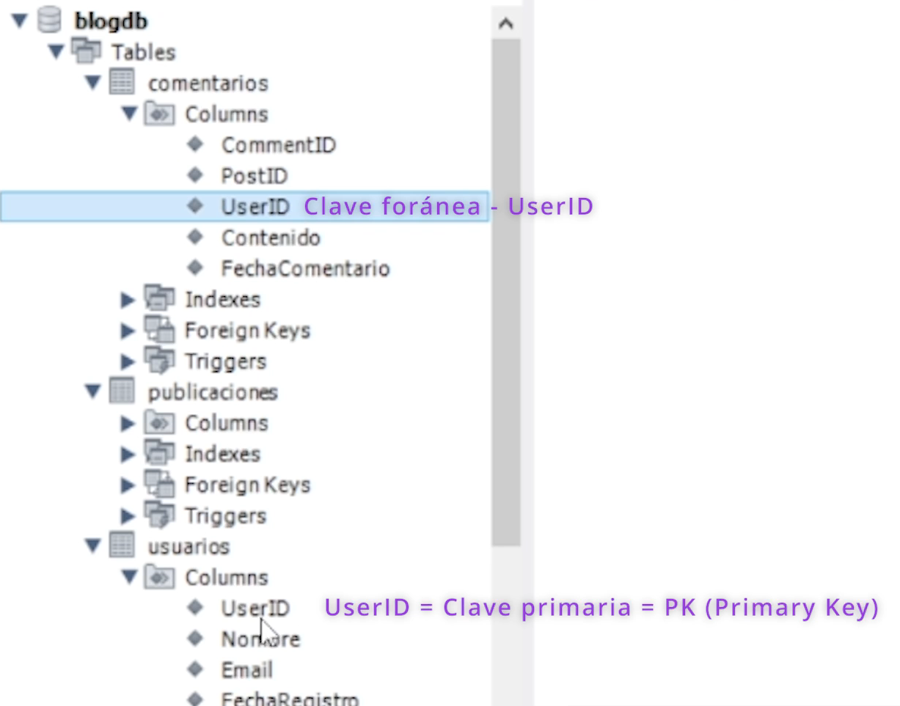


Para poder referenciar una clave foránea, debemos cambiar el PostID y el UserID a tipo entero y referenciarlos a la tabla publicaciones y usuarios respectivamente.

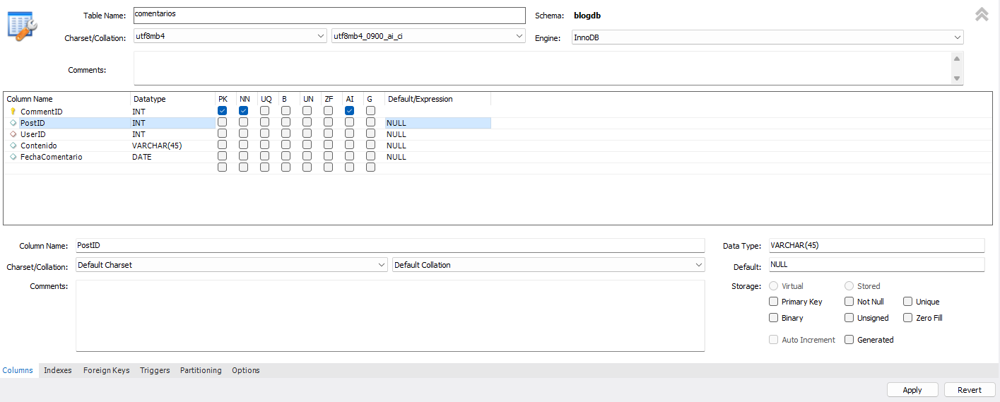

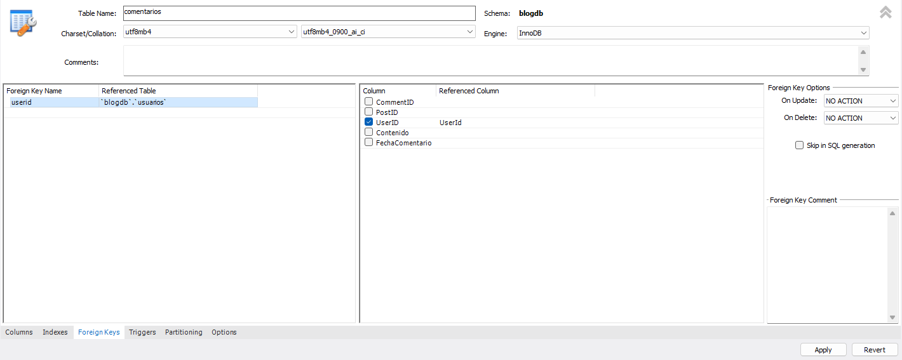

El código equivalente seria de la siguiente forma, para referenciar la clave foránea de la tabla usuarios:

```sql
ALTER TABLE `blogdb`.`comentarios`
CHANGE COLUMN `PostID` `PostID` INT NULL DEFAULT NULL ,
CHANGE COLUMN `UserID` `UserID` INT NULL DEFAULT NULL ,
ADD INDEX `userid_idx` (`UserID` ASC) VISIBLE;
;
ALTER TABLE `blogdb`.`comentarios`
ADD CONSTRAINT `userid`
  FOREIGN KEY (`UserID`)
  REFERENCES `blogdb`.`usuarios` (`UserId`)
  ON DELETE NO ACTION
  ON UPDATE NO ACTION;
```

Realizamos lo mismo para la tabla publicaciones y la clave foránea PostID:
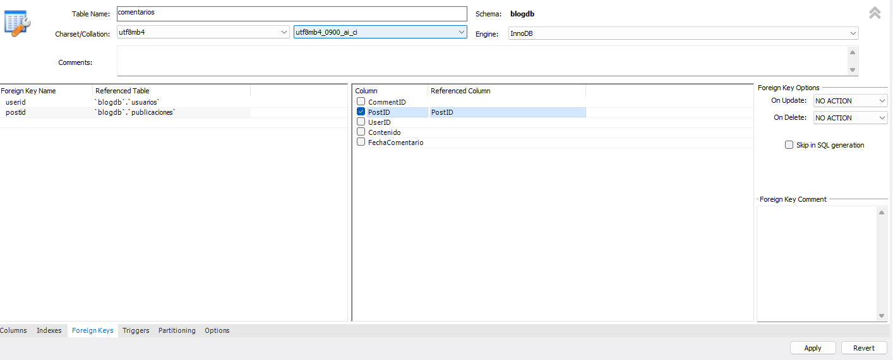

```sql
ALTER TABLE `blogdb`.`comentarios`
ADD INDEX `postid_idx` (`PostID` ASC) VISIBLE;
;
ALTER TABLE `blogdb`.`comentarios`
ADD CONSTRAINT `postid`
  FOREIGN KEY (`PostID`)
  REFERENCES `blogdb`.`publicaciones` (`PostID`)
  ON DELETE NO ACTION
  ON UPDATE NO ACTION;
```

## Insertar datos en la base de datos

Para insertar datos en la base de datos, debemos usar la sentencia INSERT INTO.

```sql
INSERT INTO  usuarios(Nombre, Email, FechaRegistro) VALUES
('Jose', 'sosebalbuena181096@gmail.com', '2025-10-10');
```

Consultar los datos de la tabla usuarios:

```sql
SELECT * FROM usuarios;
```

# Inicialización de la base de datos NetflixDB

La base de datos NetflixDB es una base de datos contiene cuatro tablas, las cuales son:

1. Usuarios
2. Episodios
3. Actores
4. Actuaciones


Para crear la base de datos NetflixDB, debemos usar la siguiente query:

```sql
CREATE DATABASE IF NOT EXISTS NetflixDB;
USE NetflixDB;

-- Creación de la tabla Series
CREATE TABLE IF NOT EXISTS Series (
    serie_id INT AUTO_INCREMENT PRIMARY KEY,
    titulo VARCHAR(255) NOT NULL,
    descripcion TEXT,
    año_lanzamiento INT,
    genero VARCHAR(255)
);

-- Creación de la tabla Episodios
CREATE TABLE IF NOT EXISTS Episodios (
    episodio_id INT AUTO_INCREMENT PRIMARY KEY,
    serie_id INT,
    titulo VARCHAR(255) NOT NULL,
    duracion INT,
    rating_imdb DECIMAL(3,1),
    temporada INT,
    descripcion TEXT,
    fecha_estreno DATE,
    FOREIGN KEY (serie_id) REFERENCES Series(serie_id)
);

-- Creación de la tabla Actores
CREATE TABLE IF NOT EXISTS Actores (
    actor_id INT AUTO_INCREMENT PRIMARY KEY,
    nombre VARCHAR(255) NOT NULL,
    fecha_nacimiento DATE
);

-- Creación de la tabla Actuaciones (relación muchos a muchos entre Actores y Series)
CREATE TABLE IF NOT EXISTS Actuaciones (
    actor_id INT,
    serie_id INT,
    personaje VARCHAR(255),
    FOREIGN KEY (actor_id) REFERENCES Actores(actor_id),
    FOREIGN KEY (serie_id) REFERENCES Series(serie_id),
    PRIMARY KEY (actor_id, serie_id)
);
```

Para insertar datos en la base de datos, debemos usar el archivo Netflix_data.sql.

```sql
source Netflix_data.sql;
```

- Quiz

¿Cuál es el principal beneficio de usar MySQL Workbench para gestionar bases de datos SQL?

Ofrece una interfaz gráfica de usuario para facilitar la administración, visualización y manipulación de bases de datos.

¿Cuál es el propósito de seleccionar la opción 'Developer Default' durante la instalación de MySQL en un sistema Windows?

Instalar MySQL Workbench y otras herramientas útiles para el desarolladores, configurando un entorno de desarollo completo.

¿Qué se necesita para ejecutar y visualizar una consulta SQL en MySQL Workbench?

Escribir la consulta y precionar 'Ctrl + Enter' para ejecutarla, luego los resultados se visualizan automaticamente en ka oarte inferior.

¿Qué acción se realiza después de ejecutar una consulta SQL en MySQL Workbench?
Ver los resultados en la parte inferior de la interface.

En MySQL Workbench, ¿cuál es el primer paso para crear una nueva base de datos?
Crear un nuevo schema o base de datos.

En la creación de una nueva base de datos para un blog, ¿por qué es esencial configurar claves primarias como 'autoincrementables'?

Para asegurar que cada entrada tiene un identificador único y se incrementa automáticamente con cada nueva entrada.

¿Para qué se utiliza el archivo `netflix_schema.sql` en la instalación de la base de datos NetflixDB?
Para definir la estructura de las tablas y relaciones de la base de datos.

¿Cómo se establece una relación entre la tabla 'Comentarios' y 'Usuarios' en la base de datos de un blog?
Usando 'UserID' en comentarios como clave foránea referenciada a 'Usuarios'.

# Proyecto del dia

Objetivo:

- Crear tu propia base de datos desde cero.

- Puede ser de cualquier tema que te interese(Deportes, Música, Libros, Películas, etc.)

- Tablas de la base de datos
  Peliculas:
  Tabla 1: Peliculas(titulo, anio_lanzamiento, director)
  Tabla 2: Actores
  Tabla 3: Generos

Tablas de la base de datos:

- Definir claves primarias
- Identificador unico
- Por ejemplo: ID_pelicula

Relaciones entre tablas:

- Definir claves foraneas
- Referencia a otra tabla
- Por ejemplo: ID_actor

Resolucion de la base de datos Prestamos:

```sql
CREATE DATABASE IF NOT EXISTS Prestamos;
USE Prestamos;

CREATE TABLE IF NOT EXISTS DetalleUsuarios(
    DetalleId INT AUTO_INCREMENT PRIMARY KEY,
    Edad INT NOT NULL,
    Matricula VARCHAR(100) UNIQUE,
    Targeta VARCHAR(100) UNIQUE,
    Programa VARCHAR(50),
    Estado ENUM('Activo', 'Inactivo') DEFAULT 'Activo'
);

CREATE TABLE IF NOT EXISTS Usuarios(
    UsuarioID INT AUTO_INCREMENT PRIMARY KEY,
    Nombre VARCHAR(100) NOT NULL,
    Apellido VARCHAR(100) NOT NULL,
    Email VARCHAR(100) UNIQUE,
    Telefono VARCHAR(20),
    detalleID INT,
    FOREIGN KEY (detalleID) REFERENCES DetalleUsuarios(DetalleId)
);

CREATE TABLE IF NOT EXISTS Categorias(
    CategoriaID INT AUTO_INCREMENT PRIMARY KEY,
    Nombre VARCHAR(50) NOT NULL,
    Descripcion TEXT
);

CREATE TABLE IF NOT EXISTS DetalleEquipos(
    EquipoDetalleId INT AUTO_INCREMENT PRIMARY KEY,
    Nombre VARCHAR(100) NOT NULL,
    CategoriaID INT,
    CantidadTotal INT NOT NULL,
    CantidadDisponible INT NOT NULL,
    Registro DATE,
    Estado ENUM('Activo', 'Inactivo') DEFAULT 'Activo',
    FOREIGN KEY (CategoriaID) REFERENCES Categorias(CategoriaID)
);

CREATE TABLE IF NOT EXISTS Equipos(
    EquipoID INT AUTO_INCREMENT PRIMARY KEY,
    Nombre VARCHAR(100) NOT NULL,
    Etiqueta VARCHAR(100) UNIQUE,
    NFC VARCHAR(100) UNIQUE,
    DetalleID INT,
    Estado ENUM('Disponible', 'Prestado') DEFAULT 'Disponible',
    FOREIGN KEY (DetalleID) REFERENCES DetalleEquipos(EquipoDetalleId)
);

CREATE TABLE IF NOT EXISTS Prestamos(
    PrestamoID INT AUTO_INCREMENT PRIMARY KEY,
    UsuarioID INT,
    FechaPrestamo DATETIME DEFAULT CURRENT_TIMESTAMP,
    Estado ENUM('Activo', 'Finalizado') DEFAULT 'Activo',
    FOREIGN KEY (UsuarioID) REFERENCES Usuarios(UsuarioID)
);

CREATE TABLE IF NOT EXISTS DetallePrestamos(
    DetallePrestamoID INT AUTO_INCREMENT PRIMARY KEY,
    PrestamoID INT,
    EquipoID INT,
    Cantidad INT NOT NULL DEFAULT 1,
    Estado ENUM('Prestado', 'Devuelto') DEFAULT 'Prestado',
    FOREIGN KEY (PrestamoID) REFERENCES Prestamos(PrestamoID),
    FOREIGN KEY (EquipoID) REFERENCES Equipos(EquipoID)
);

CREATE TABLE IF NOT EXISTS HistorialPrestamos(
    HistorialID INT AUTO_INCREMENT PRIMARY KEY,
    PrestamoID INT,
    UsuarioID INT,
    EquipoID INT,
    Cantidad INT NOT NULL,
    FechaPrestamo DATETIME,
    FechaDevolucion DATETIME,
    Estado ENUM('Prestado', 'Devuelto') DEFAULT 'Prestado',
    FOREIGN KEY (PrestamoID) REFERENCES Prestamos(PrestamoID),
    FOREIGN KEY (UsuarioID) REFERENCES Usuarios(UsuarioID),
    FOREIGN KEY (EquipoID) REFERENCES Equipos(EquipoID)
);

-- Trigger para registrar en el historial cuando se crea un préstamo
DELIMITER //
CREATE TRIGGER after_prestamo_insert
AFTER INSERT ON DetallePrestamos
FOR EACH ROW
BEGIN
    INSERT INTO HistorialPrestamos (
        PrestamoID, 
        UsuarioID, 
        EquipoID, 
        Cantidad, 
        FechaPrestamo,
        Estado
    )
    SELECT 
        NEW.PrestamoID,
        p.UsuarioID,
        NEW.EquipoID,
        NEW.Cantidad,
        p.FechaPrestamo,
        NEW.Estado
    FROM Prestamos p
    WHERE p.PrestamoID = NEW.PrestamoID;
END //
DELIMITER ;

-- Trigger para actualizar el historial cuando se devuelve un equipo
DELIMITER //
CREATE TRIGGER after_prestamo_update
AFTER UPDATE ON DetallePrestamos
FOR EACH ROW
BEGIN
    IF NEW.Estado = 'Devuelto' AND OLD.Estado = 'Prestado' THEN
        UPDATE HistorialPrestamos
        SET 
            Estado = 'Devuelto',
            FechaDevolucion = NOW()
        WHERE 
            PrestamoID = NEW.PrestamoID 
            AND EquipoID = NEW.EquipoID
            AND Estado = 'Prestado';
    END IF;
END //
DELIMITER ;
```

```SQL
-- Insertar categorías de equipos
INSERT INTO Categorias (Nombre, Descripcion) VALUES
('Computadoras', 'Equipos de cómputo y laptops'),
('Proyectores', 'Equipos de proyección'),
('Audio', 'Equipos de audio y sonido'),
('Video', 'Equipos de video y cámaras'),
('Redes', 'Equipos de red y conectividad');

-- Insertar detalles de usuarios
INSERT INTO DetalleUsuarios (Edad, Matricula, Targeta, Programa) VALUES
(20, '2023001', 'T001', 'Sistemas'),
(22, '2023002', 'T002', 'Industrial'),
(19, '2023003', 'T003', 'Mecanica'),
(21, '2023004', 'T004', 'Electronica'),
(23, '2023005', 'T005', 'Civil');

-- Insertar usuarios
INSERT INTO Usuarios (Nombre, Apellido, Email, Telefono, detalleID) VALUES
('Juan', 'Pérez', 'juan.perez@email.com', '555-0001', 1),
('María', 'González', 'maria.gonzalez@email.com', '555-0002', 2),
('Carlos', 'Rodríguez', 'carlos.rodriguez@email.com', '555-0003', 3),
('Ana', 'Martínez', 'ana.martinez@email.com', '555-0004', 4),
('Pedro', 'López', 'pedro.lopez@email.com', '555-0005', 5);

-- Insertar detalles de equipos
INSERT INTO DetalleEquipos (Nombre, CategoriaID, CantidadTotal, CantidadDisponible, Registro) VALUES
('Laptop HP', 1, 10, 10, CURDATE()),
('Proyector Epson', 2, 5, 5, CURDATE()),
('Micrófono Shure', 3, 8, 8, CURDATE()),
('Cámara Canon', 4, 3, 3, CURDATE()),
('Router Cisco', 5, 6, 6, CURDATE());

-- Insertar equipos individuales
INSERT INTO Equipos (Nombre, Etiqueta, NFC, DetalleID) VALUES
('Laptop HP 1', 'LAP-001', 'NFC-001', 1),
('Laptop HP 2', 'LAP-002', 'NFC-002', 1),
('Proyector Epson 1', 'PROJ-001', 'NFC-003', 2),
('Micrófono Shure 1', 'MIC-001', 'NFC-004', 3),
('Cámara Canon 1', 'CAM-001', 'NFC-005', 4);

-- Ejemplo 1: Préstamo de una laptop
INSERT INTO Prestamos (UsuarioID) VALUES (1);
INSERT INTO DetallePrestamos (PrestamoID, EquipoID, Cantidad) VALUES (1, 1, 1);

-- Ejemplo 2: Préstamo de un proyector
INSERT INTO Prestamos (UsuarioID) VALUES (2);
INSERT INTO DetallePrestamos (PrestamoID, EquipoID, Cantidad) VALUES (2, 3, 1);

-- Ejemplo 3: Préstamo de un micrófono
INSERT INTO Prestamos (UsuarioID) VALUES (3);
INSERT INTO DetallePrestamos (PrestamoID, EquipoID, Cantidad) VALUES (3, 4, 1);

-- Ejemplo 4: Préstamo de una cámara
INSERT INTO Prestamos (UsuarioID) VALUES (4);
INSERT INTO DetallePrestamos (PrestamoID, EquipoID, Cantidad) VALUES (4, 5, 1);

-- Ejemplo 5: Préstamo múltiple (laptop y proyector)
INSERT INTO Prestamos (UsuarioID) VALUES (5);
INSERT INTO DetallePrestamos (PrestamoID, EquipoID, Cantidad) VALUES 
(5, 2, 1),  -- Laptop
(5, 3, 1);  -- Proyector

-- Ejemplo de devolución de un equipo
UPDATE DetallePrestamos 
SET Estado = 'Devuelto' 
WHERE PrestamoID = 1 AND EquipoID = 1;
```
