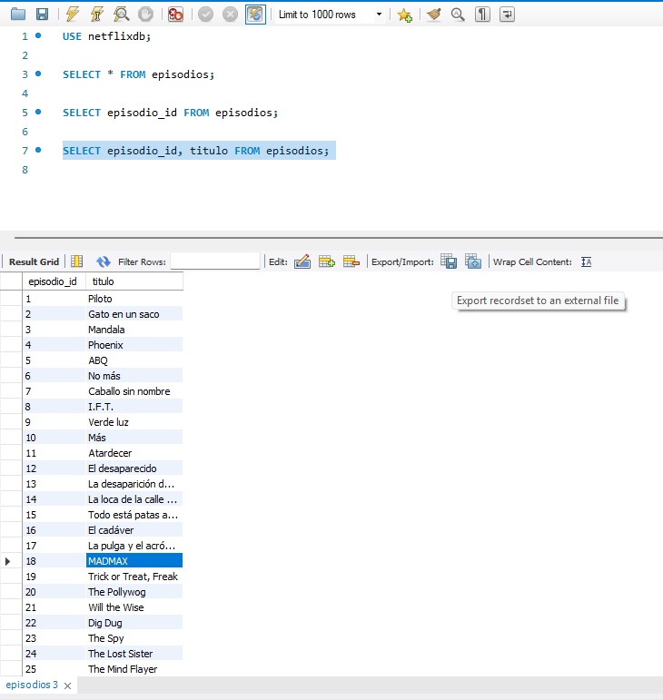
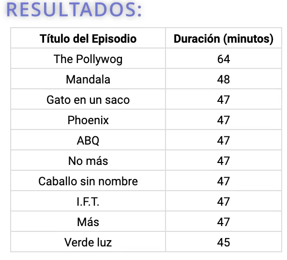

# Consultas Basicas de SQL

- SELECT
- SUM(), COUNT(), MAX(), MIN(), AVG()
- WHERE, ORDER BY, GROUP BY, BETWEEN, IN, LIKE

## ¿Qué es una "Query"?

- Query = consulta
- Una consulta en SQL es hacerle una pregunta a la base de datos.
- Las consultas de SQL se componen por sentencias, comandos y cláusulas.

## Sentencias SELECT

- SELECT permite seleccionar columnas de una base de datos.
- Siempre debes utilizar SELECT para seleccionar columnas de una base de datos.

Utilizamos "\*" para obtener todas las columnas de una tabla.

```sql
USE netflixdb;

SELECT * FROM episodios;
```

Seleccionar una sola columna de una tabla:

```sql
SELECT episodio_id FROM episodios;
```

Seleccionar varias columnas de una tabla:

```sql
SELECT episodio_id, titulo FROM episodios;
```

Recomendación: Utilizar mayúsculas para las sentencias y comandos de SQL.

Para exportar los resultados seleccionar "Exportar" en la barra de herramientas de MySQL Workbench.



## Práctica SELECT 1

Enunciado:

Escribe una consulta de SQL para obtener todos los registros de la tabla Actores.

```sql
SELECT * FROM actores;
```

## Práctica SELECT 2

Enunciado:

Escribe una consulta SQL que seleccione las columnas titulo y temporada de todos los episodios disponibles en la tabla Episodios

```SQL
SELECT titulo, temporada FROM Episodios;
```

## CLÁUSULA DISTINCT

- DISTINCT te permite seleccionar valores únicos de una columna.

SELECT es una sentencia, DISTINCT es una cláusula, los dos son comandos SQL para realizar una acción.

```SQL
SELECT DISTINCT genero FROM series;
```

Permite seleccionar valores únicos de una columna de genero de la tabla series.

## Práctica 3 DISTINCT

Enunciado:

Escribe una consulta SQL que seleccione todos los años únicos de lanzamiento (columna: año_lanzamiento) de las series disponibles, desde la tabla Series

```SQL
SELECT DISTINCT año_lanzamiento  FROM Series;
```

## Cláusula ORDER BY

- ORDER BY permite ordenar los resultados de una consulta de manera ascendente (ASC) o descendente (DESC).

Supongamos que queremos realizar la siguiente consulta:

```SQL
SELECT titulo, duracion FROM Episodios;
```


Si quisieramos ordenar los resultados de forma descendente, podríamos utilizar la cláusula ORDER BY. Por defecto ordena de forma ascendente (ASC).

```SQL
SELECT titulo, duracion FROM Episodios ORDER BY duracion DESC;
```



## Práctica ORDER BY 1

Enunciado:

Escribe una consulta SQL que seleccione todos los años de lanzamiento únicos de la tabla Series

Los resultados deben estar ordenados de forma descendente, es decir, del más reciente al más antiguo.

Ordenar por el campo año_lanzamiento de forma descendente (DESC).

Seleccionar únicamente valores de año_lanzamiento únicos.

```sql
SELECT DISTINCT año_lanzamiento FROM Series ORDER BY  año_lanzamiento DESC;
```

## Práctica ORDER BY 2

Enunciado:

Escribe una consulta SQL que seleccione los nombres (nombre) y las fechas de nacimiento (fecha_nacimiento) de todos los actores desde la tabla Actores

Ordena los resultados de manera descendente (DESC) por la fecha de nacimiento, lo que significa que los actores más jóvenes aparecerán primero en tu lista.

```sql
SELECT nombre, fecha_nacimiento FROM Actores ORDER BY fecha_nacimiento DESC;
```

## Cláusula LIMIT

- LIMIT permite limitar el número de resultados devueltos por una consulta.

```sql
SELECT * FROM episodios LIMIT 5;
```

- Ordenar y limitar los resultados de una consulta.

```sql
SELECT * FROM episodios ORDER BY duracion DESC LIMIT 5;
```

## Práctica LIMIT

Enunciado:

Escribe una consulta que seleccione los nombres nombre de los primeros 5 actores en la tabla Actores

```sql
SELECT nombre FROM Actores LIMIT 5;
```

## CLÁUSULA WHERE

- WHERE te permite filtrar los resultados en función de una determinada condición.

Filtrar las series cuyo género sea Drama.

```sql
SELECT * FROM Series WHERE genero = 'Drama';
```

Filtrar las series cuyo año de lanzamiento sea mayor a 2010.

```sql
SELECT * FROM Series WHERE año_lanzamiento > 2010;
```

## Práctica WHERE

Enunciado:

Escribe una consulta que seleccione todos los registros \* de la tabla Series cuyo género sea igual a 'Comedia'.

```sql
SELECT * FROM Series WHERE genero = 'Comedia';
```

## Operadores de comparación

- Permiten comparar valores para determinar una condición.

- = Igual
- <> Desigual
- > Mayor que
- < Menor que
- > = Mayor o igual que
- <= Menor o igual que

Filtrar series que se lanzaron despues del 2015:

```sql
SELECT * FROM Series WHERE año_lanzamiento > 2015;
```

## Práctica operadores de comparación

Enunciado:

Escribe una consulta SQL que seleccione el título y el año_lanzamiento de las series, de la tabla Series, cuyo año de lanzamiento sea mayor a 2020

Sugerencias:

Utiliza la cláusula WHERE para aplicar este filtro

Utilizar la tabla Series

Utilizar el operador de comparación mayor que >

```sql
SELECT titulo, año_lanzamiento FROM Series WHERE  año_lanzamiento > 2020;
```

## Operadores logicos

- Sirven para combinar varias condiciones.

- "AND" lo utilizamos cuando se cumplan dos o más condiciones

Ejemplo, traer episodios que tengan una duracion de mas de 30 min y su rating sea mayor a 8.

```sql
SELECT titulo FROM Episodios WHERE duracion > 30 AND rating_imdb > 8;
```

- "OR" lo utilizamos con WHERE para incluir filas donde cualquiera de las condiciones es verdadera.

- "NOT" se utiliza con WHERE para incluir filas donde una condición es falsa (no es verdadera).

Ejemplos con el uso de operadores logicos:

- Encontrar episodios con una duracion de mas de 45 min y un rating mayor o igual a 9.

```sql
SELECT titulo, duracion, rating_imdb FROM Episodios WHERE duracion > 45 AND rating_imdb >= 9;
```

- Encontrar toodas las series que son comedia o animacion:

```sql
SELECT * FROM Series WHERE
(genero = 'Comedia' OR genero = 'Animacion');
```

- Encontrar todas las series que son de un genero distinto a Comedia:

```sql
SELECT * FROM Series WHERE genero <> 'Comedia';
```

## Práctica operadores lógicos (AND, OR, NOT)

Enunciado:

Escribe una consulta SQL que seleccione todas las columnas de todas las series en la tabla Series, donde el género sea 'Drama' o 'Ciencia ficción'

Sugerencias:

Utiliza la cláusula WHERE para aplicar este filtro

Utiliza el comparador lógico OR para incluir más de una condición en el WHERE

Un ejemplo si queremos obtener todos los datos de la tabla Series que cumplan con la condición de tener género igual a 'Comedia' o (OR) 'Animación', podría realizarse utilizando la siguiente consulta:

```sql
SELECT * FROM Series WHERE
(genero = 'Drama' or genero =  'Ciencia ficción');
```

## OPERADOR IN, NOT IN

- El operador IN se utiliza para verificar si un valor pertenece a una lista de valores.

- El operador NOT IN se utiliza para verificar si un valor no pertenece a una lista de valores.

Ejemplo:

```sql
SELECT * FROM Series WHERE genero NOT IN('Comedia');
```

Pueden incluirse varias condiciones en el IN

Esta consulta selecciona todas las series que son del género Comedia o Fantasía.

```sql
SELECT * FROM Series WHERE genero IN('Comedia', 'Fantasía');
```

## Práctica IN/NOT IN

Enunciado:

Escribe una consulta SQL que seleccione todas las columnas de todas las series en la tabla Series , excluyendo aquellas cuyo género sea 'Drama' o 'Drama histórico'

Sugerencias:

Utiliza la cláusula WHERE combinada con NOT IN para especificar los géneros que deseas excluir

Un ejemplo si queremos obtener todos los datos de la tabla Series que no cumplan con la condición de tener género igual a 'Comedia' y 'Animación', podría ser el siguiente:

```sql
SELECT * FROM Series WHERE genero NOT IN('Drama', 'Drama histórico');
```

## Cláusula LIKE

¿Cómo filtrar las series que contengan la palabra "The" en el titulo?

- La cláusula LIKE se utiliza en el WHERE para buscar un patrón especifíco en una columna.

```SQL
SELECT * FROM Series WHERE titulo LIKE '%The%';
```

- La consulta anterior selecciona todas las series que contienen la palabra "The" en algun lado del titulo.

La sentencia like permite buscar un patrón en una columna. Este patron puede contener simbolos especiales.

- El simbolo % se utiliza para representar cero, uno o varios caracteres.

- El simbolo \_ se utiliza para representar un solo caracter.

```SQL
SELECT * FROM Series WHERE titulo NOT LIKE '%The%';
```

- La consulta anterior selecciona todas las series que no contienen la palabra "The" en algun lado del titulo.

## Práctica LIKE

Enunciado:

Escribe una consulta SQL que seleccione solo la columna titulo de la tabla Series y solo las series que posean la palabra 'The' en su titulo.

Sugerencias:

Utiliza el operador WHERE y LIKE con sus comodines (ejemplo: LIKE '%man%')

Verifica que estás usando comillas simples alrededor del patrón en la cláusula LIKE

```SQL
SELECT titulo FROM Series WHERE titulo LIKE '%The%';
```

## Funciones de agregado

- Son funciones que realizan cálculos sobre grupos de valores y devuelven un único valor resultado.

- Tipos de funciones: SUM(), COUNT(), AVG(), MAX(), MIN()

## SUM()

- SUM() suma todos los valores de una columna.

Calcular la duracion de todo nuestro contenido en minutos:

```SQL
SELECT SUM(duracion) FROM episodios;
```

Al resultado de la consulta, se le puede dar un alias para que sea mas legible.

```SQL
SELECT SUM(duracion) AS suma_duracion FROM episodios;
```

Se puede combinar con WHERE, ejemplo obtenener la suma de la duracion de la serie 5.

```SQL
SELECT SUM(duracion) AS suma_duracion FROM Episodios WHERE serie_id = 5;
```

## COUNT

- COUNT() cuenta el número de filas de una tabla.

Contar el número de episodios de la serie con id 2:

```SQL
SELECT COUNT(*) FROM episodios WHERE serie_id = 2;
```

## MAX()

- MAX() devuelve el valor maximo de una columna.

Calcular la duracion maxima de minutos de la serie con id 2:

```SQL
SELECT MAX(duracion) FROM Episodios WHERE serie_id = 2;
```

## MIN()

- MIN() devuelve el valor minimo de una columna.

Calcular la duracion minima de minutos de la serie con id 2:

```SQL
SELECT MIN(duracion) FROM Episodios WHERE serie_id = 2;
```

## AVG()

- AVG() devuelve el valor promedio de una columna.

Calcular la duracion promedio de duracion de todos los episodios:

```SQL
SELECT AVG(duracion) FROM episodios;
```

Calcular el promedio de duracion de la serie con id 2 y 1:

```SQL
SELECT AVG(duracion) FROM Episodios WHERE serie_id IN (2, 1);
```

## Práctica funciones de agregado

Enunciado:

Escribe una consulta SQL que calcule la duración total de todos los episodios presentes en la tabla Episodios de la base de datos NetflixDB

Sugerencias:

Utiliza la función de agregado SUM() sobre la columna duracion para obtener el resultado total

Esta consulta te dará un único valor como resultado: la suma total de las duraciones de todos los episodios

```SQL
SELECT SUM(duracion) FROM Episodios;
```

## CLÁUSULA GROUP BY

- GROUP BY agrupa filas que tienen los mismos valores en filas de resumen, como "buscar la cantidad de episodios de cada serie".

Calcular el promedio de duracion de los episodios de la serie con id 2 y 1:

```SQL
SELECT serie_id, AVG(duracion) AS promedio FROM Episodios
WHERE serie_id IN (2, 1)
GROUP BY serie_id;
```

El GROUP BY siempre va acompañado del nombre de la columna sobre la que se va a agrupar.

```sql
SELECT serie_id, AVG(duracion) AS promedio, SUM(duracion) AS suma FROM Episodios
WHERE serie_id IN (2, 1)
GROUP BY serie_id;
```

Agrupar por la columna serie_id, donde se agrupa por el id de la serie.

```SQL
SELECT serie_id FROM Episodios GROUP BY 1;
```

Contar la cantidad de episodios por cada serie.

```SQL
SELECT serie_id, COUNT(episodio_id) AS count_episodios FROM Episodios GROUP BY 1;
```

Agrupar por maxima duracion de los episodios de cada serie.

```SQL
SELECT serie_id, MAX(duracion) AS max_duracion FROM Episodios GROUP BY 1;
```

## Práctica GROUP BY

Enunciado:

Escribe una consulta SQL que seleccione el año de lanzamiento de las series en la tabla Series , y cuenta el número de series lanzadas en cada año

Sugerencias:

Agrupa los resultados por año de lanzamiento utilizando GROUP BY año_lanzamiento

Ordena el resultado final de manera ascendente por el año de lanzamiento

Utiliza la función de agregado COUNT(serie_id) para contar la cantidad de series por año de lanzamiento

El resultado debe mostrarse en dos columnas: año_lanzamiento y cantidad_de_series, donde esta última representa el número de series lanzadas ese año.

Utiliza la creación de alias con AS para asignarle un alias (un nombre) al cálculo de COUNT(serie_id)

```SQL
SELECT año_lanzamiento, COUNT(serie_id) AS cantidad_de_series FROM Series GROUP BY año_lanzamiento ORDER BY año_lanzamiento ASC;
```

## Clausula HAVING

- HAVING se utiliza para filtrar los resultados de una consulta agrupada.

- WHERE: se puede usar con o sin GROUP BY, ya que filtra filas antes de ser agrupadas.

- HAVING: deber ser utilizado junto con un GROUP BY.

Ejemplo de uso:
Encontrar todas las series en NetflixDB que tengan MAS DE 10 episodios.

```SQL
SELECT serie_id, COUNT(episodio_id) AS numero_episodios
FROM Episodios GROUP BY serie_id
HAVING numero_episodios > 10;
```

La diferencia principal entre el WHERE y el HAVING es que el WHERE se ejecuta antes de agrupar los datos, mientras que el HAVING se ejecuta después de agrupar los datos y having solo se utiliza sobre funciones de agregación (SUM, COUNT, AVG, MAX, MIN).

Traer la serie con mas de 10 episodios. Donde serie_id = 2 y 1.

```SQL
SELECT serie_id, COUNT(episodio_id) AS numero_episodios
FROM Episodios
WHERE serie_id IN (2, 1)
GROUP BY serie_id
HAVING numero_episodios > 10;
```

## Práctica HAVING

Enunciado:

Escribe una consulta SQL que sume la duración total de todos los episodios de la serie con serie_id = 2 por temporada desde la tabla Episodios

Aplica un filtro con HAVING sobre la suma agregada, solo incluir temporadas cuya duración total sea mayor a 400 minutos

Agrupara los resultados por temporada

Tu resultado debe mostrar dos columnas: temporada y duracion_total

Sugerencias:

Filtra los resultados con WHERE serie_id = 2

Utiliza la creación de alias con AS para asignarle un alias (un nombre) al cálculo de SUM(duracion) AS duracion_total

Tu resultado debe mostrar dos columnas: temporada y duracion_total, siendo esta última la suma de la duración de los episodios por temporada que cumpla con el criterio mencionado.

```SQL
SELECT temporada, SUM(duracion) AS duracion_total
FROM Episodios
WHERE serie_id = 2
GROUP BY temporada
HAVING duracion_total > 400;
```

- QUIZ
  Pregunta 1:
  ¿Qué sentencia de SQL se utiliza para recuperar registros de una base de datos?

Respuesta:
SELECT

Pregunta 2:
¿Qué hace la cláusula DISTINCT en una consulta SQL?

Respuesta:
Elimina filas duplicadas.

Pregunta 3:
¿Qué hace la cláusula ORDER BY en una consulta SQL?

Respuesta:
Ordena el conjunto de resultados en orden ascendente o descendente.

Pregunta 4:
¿Qué cláusula se utiliza en SQL para filtrar registros?

Respuesta:
WHERE

Pregunta 5:
¿Qué hace el operador IN en una consulta SQL?

Respuesta:
Verifica si un valor coincide con cualquier valor en una lista de valores.

Pregunta 6:
¿Qué función se utiliza para contar el número de filas en una tabla de base de datos?

Respuesta:
COUNT()

Pregunta 7:
¿Qué hace la cláusula GROUP BY en una consulta SQL?

Respuesta:
Agrupa filas que tienen los mismos valores en columnas especificas.

Reto 3:

Base de datos NetflixDB

Tabla: Actores

+-------------------+----------+
| Nombre de Columna | Tipo |
+-------------------+----------+
| actor_id | int |
| nombre | text |
| fecha_nacimiento | date |
+-------------------+----------+
actor_id es la clave primaria (columna con valores únicos) para esta tabla.
Cada fila de esta tabla indica el ID, nombre y fecha de nacimiento de un actor.

Tabla: Series

+-------------------+----------+
| Nombre de Columna | Tipo |
+-------------------+----------+
| serie_id | int |
| titulo | text |
| descripcion | text |
| año_lanzamiento | int |
| genero | text |
+-------------------+----------+
serie_id es la clave primaria (columna con valores únicos) para esta tabla.
Cada fila de esta tabla indica el ID, título, descripción, año de lanzamiento y género de una serie.

Tabla: Episodios

+-------------------+----------+
| Nombre de Columna | Tipo |
+-------------------+----------+
| episodio_id | int |
| serie_id | int |
| titulo | text |
| duracion | int |
| rating_imdb | int |
| temporada | int |
| descripcion | text |
| fecha_estreno | date |
+-------------------+----------+
episodio_id es la clave primaria (columna con valores únicos) para esta tabla.
serie_id es una clave foránea (columnas de referencia) de la serie_id de la tabla Series.
Cada fila de esta tabla indica el ID de un episodio, el ID de la serie a la que pertenece, título, duración, rating en IMDb, temporada, descripción y fecha de estreno.

Tabla: Actuaciones

+-------------------+----------+
| Nombre de Columna | Tipo |
+-------------------+----------+
| actor_id | int |
| serie_id | int |
| personaje | text |
+-------------------+----------+
actor_id y serie_id son claves primarias compuestas para esta tabla, y cada una es también una clave foránea que referencia las tablas Actores y Series, respectivamente.
Cada fila de esta tabla indica el ID del actor, el ID de la serie y el personaje interpretado por el actor en la serie.

Preguntas Sugeridas:

¿Quien es el actor o actriz que ha participado en la mayor cantidad de series?

```SQL
SELECT actor_id , COUNT(serie_id) AS series_totales
FROM  Actuaciones
GROUP BY actor_id
ORDER BY COUNT(*) DESC LIMIT 1;
```

¿Cuál es la serie con raiting de imdb promedio más alto?

¿Cual es el episodio mas largo?
