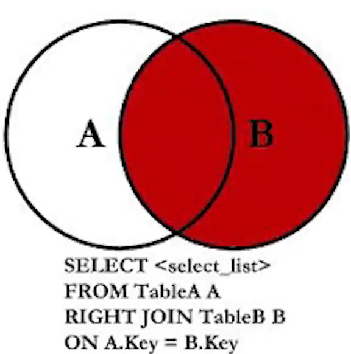

# JOIN SQL

Son una forma de combinar filas de dos o mas tablas en una sola consulta.


Poder unir informacion de una o mas tablas, para dar respuesta a preguntas complejas.

Por ejemplo tenemos las siguientes tablas Series y Episodios :


Por ejemplo buscar todos los episodios de una serie en particular.


```sql
SELECT
    E.episodio_id,
    E.serie_id,
    S.titulo AS 'Nombre de la Serie'
FROM episodios E
JOIN series S ON E.serie_id = S.serie_id
WHERE
    S.titulo = 'Stranger Things';
```

El dato en comun entre las dos tablas, se le denomina clave foranea, y es el que une las tablas.


Existen diferentes tipos de JOINs, los cuales se diferencian por la forma en que se unen las tablas.

Los JOINs mas comunes son:

- INNER JOIN
- LEFT JOIN
- RIGHT JOIN
- FULL JOIN
- CROSS JOIN


## INNER JOIN

El INNER JOIN es el JOIN mas comun, y es el que se usa por defecto. Une las tablas solo si hay coincidencias en la clave foranea.

En el siguiente diagrama la operación del INNER JOIN se representa como la aparte donde estos dos conjuntos de datos se intersectan. Registros que coincidan en ambas tablas.


Unir la tabla de series con la tabla de actuaciones:

```sql
SELECT * FROM series
INNER JOIN Actuaciones ON Series.serie_id = Actuaciones.serie_id;
```

Si solo quisieramos el titulo y personaje de la union de la tabla series y actuaciones:

```sql
SELECT
    S.titulo,
    A.personaje
FROM series S
INNER JOIN Actuaciones A ON S.serie_id = A.serie_id;
```

EL INNER JOIN es el JOIN mas comun, y es el que se usa por defecto. Une las tablas solo si hay coincidencias en la clave foranea.

Con el INNER JOIN tambien podemos usar el WHERE para filtrar los resultados. Por ejemplo buscar todos los actores de una serie en particular como Stranger Things.

```sql
SELECT
    S.titulo,
    A.personaje
FROM series S
INNER JOIN Actuaciones A ON S.serie_id = A.serie_id
WHERE
    S.titulo = 'Stranger Things';
```

### Práctica INNER JOIN 1

#### Enunciado:

Escribe una consulta SQL que seleccione todos los campos de las tablas Series y Episodios donde el serie_id coincida entre ambas tablas, utiliza un INNER JOIN para realizar el join entre ambas tablas.

#### Aclaración Importante

Debido a una limitación técnica de la plataforma de codificación de Udemy, debes limitar el resultado a 10 filas (porque excede la cantidad de datos disponibles a imprimir en pantalla). Debes utilizar LIMIT 10 al final de tu consulta.

#### Sugerencias:

Aplica INNER JOIN para unir las tablas Series y Episodios

Asegúrate de que el join utilice como clave el campo serie_id que es común en ambas tablas, en este caso, ON Series.serie_id = Episodios.serie_id

Syntaxis de ayuda:

SELECT \* FROM table1
INNER JOIN table2
ON table1.column_name = table2.column_name;

```SQL
SELECT *
FROM Series S
INNER JOIN Episodios E
ON  S.serie_id = E.serie_id
LIMIT 10;
```

## Práctica INNER JOIN 2

### Enunciado:

Escribe una consulta SQL que te permita obtener el título de la serie, el título de cada episodio y su duración de la serie 'Stranger Things'.

El resultado final debe contar con los siguientes nombres de columnas: titulo_serie, titulo_episodio, duracion.

### Sugerencias:

Para lograr esto, necesitarás hacer uso de INNER JOIN para combinar la tabla Series con Episodios basándote en la clave común serie_id

Utiliza la cláusula WHERE para filtrar los resultados solo para Serie.titulo = 'Stranger Things'

Recuerda que puedes utilizar AS para asignar un alias a una columna. Asegúrate de asignar alias apropiados a los títulos para diferenciarlos.

### Base de datos NetflixDB

#### Tabla: Actores

+-------------------+----------+
| Nombre de Columna | Tipo |
+-------------------+----------+
| actor_id | int |
| nombre | text |
| fecha_nacimiento | date |
+-------------------+----------+
actor_id es la clave primaria (columna con valores únicos) para esta tabla.
Cada fila de esta tabla indica el ID, nombre y fecha de nacimiento de un actor.

#### Tabla: Series

+-------------------+----------+
| Nombre de Columna | Tipo |
+-------------------+----------+
| serie_id | int |
| titulo | text |
| descripcion | text |
| año_lanzamiento | int |
| genero | text |
+-------------------+----------+
serie_id es la clave primaria (columna con valores únicos) para esta tabla.
Cada fila de esta tabla indica el ID, título, descripción, año de lanzamiento y género de una serie.

#### Tabla: Episodios

+-------------------+----------+
| Nombre de Columna | Tipo |
+-------------------+----------+
| episodio_id | int |
| serie_id | int |
| titulo | text |
| duracion | int |
| rating_imdb | int |
| temporada | int |
| descripcion | text |
| fecha_estreno | date |
+-------------------+----------+
episodio_id es la clave primaria (columna con valores únicos) para esta tabla.
serie_id es una clave foránea (columnas de referencia) de la serie_id de la tabla Series.
Cada fila de esta tabla indica el ID de un episodio, el ID de la serie a la que pertenece, título, duración, rating en IMDb, temporada, descripción y fecha de estreno.

#### Tabla: Actuaciones

+-------------------+----------+
| Nombre de Columna | Tipo |
+-------------------+----------+
| actor_id | int |
| serie_id | int |
| personaje | text |
+-------------------+----------+
actor_id y serie_id son claves primarias compuestas para esta tabla, y cada una es también una clave foránea que referencia las tablas Actores y Series, respectivamente.
Cada fila de esta tabla indica el ID del actor, el ID de la serie y el personaje interpretado por el actor en la serie.

```SQL
SELECT S.titulo AS titulo_serie, E.titulo AS titulo_episodio,  duracion
FROM Series S
INNER JOIN Episodios E
ON S.serie_id = E.serie_id
WHERE  S.titulo = 'Stranger Things';
```

## LEFT JOIN

El LEFT JOIN une las tablas solo si hay coincidencias en la clave foranea, pero si no hay coincidencias, se devuelven NULL. La diferencia con el INNER JOIN es que el LEFT JOIN devuelve todas las filas de la tabla izquierda, y las filas de la tabla derecha que coincidan con la clave foranea.

En el siguiente diagrama la operación del LEFT JOIN se representa como los datos de la tabla izquierda, y los datos de la tabla derecha que coincidan con la clave foranea. Lo de color rojo.


LEFT JOIN = LEFT OUTER JOIN

Ejemplo, tener una lista de todas las series, y cualquier episodio que tenga.

```SQL
SELECT series.titulo AS 'Titulo de la serie', episodios.titulo AS 'Titulo del episodio'
FROM series
LEFT JOIN episodios ON series.serie_id = episodios.serie_id
ORDER BY series.titulo;
```

## Práctica LEFT JOIN 1

### Enunciado:

Escribe una consulta SQL que devuelva, para cada serie, su título, el título de cada episodio asociado (si hay alguno), y el rating de IMDb.

Los alias exactos que debes aplicar son: Título de la Serie, Título del Episodio, Rating IMDB

Ordena los resultados por el título de la serie de forma ascendente

### Sugerencias:

Aplica LEFT JOIN para unir la tabla Series con Episodios, utilizando serie_id como la llave común.

La tabla de la izquierda debe ser Series y la de la derecha Episodios

Asegúrate de que el join utilice como clave el campo serie_id que es común en ambas tablas, en este caso, ON Series.serie_id = Episodios.serie_id

Syntaxis de ayuda:

SELECT \* FROM table1
LEFT JOIN table2
ON table1.column_name = table2.column_name;

Base de datos NetflixDB

### Tabla: Actores

+-------------------+----------+
| Nombre de Columna | Tipo |
+-------------------+----------+
| actor_id | int |
| nombre | text |
| fecha_nacimiento | date |
+-------------------+----------+
actor_id es la clave primaria (columna con valores únicos) para esta tabla.
Cada fila de esta tabla indica el ID, nombre y fecha de nacimiento de un actor.

### Tabla: Series

+-------------------+----------+
| Nombre de Columna | Tipo |
+-------------------+----------+
| serie_id | int |
| titulo | text |
| descripcion | text |
| año_lanzamiento | int |
| genero | text |
+-------------------+----------+
serie_id es la clave primaria (columna con valores únicos) para esta tabla.
Cada fila de esta tabla indica el ID, título, descripción, año de lanzamiento y género de una serie.

### Tabla: Episodios

+-------------------+----------+
| Nombre de Columna | Tipo |
+-------------------+----------+
| episodio_id | int |
| serie_id | int |
| titulo | text |
| duracion | int |
| rating_imdb | int |
| temporada | int |
| descripcion | text |
| fecha_estreno | date |
+-------------------+----------+
episodio_id es la clave primaria (columna con valores únicos) para esta tabla.
serie_id es una clave foránea (columnas de referencia) de la serie_id de la tabla Series.
Cada fila de esta tabla indica el ID de un episodio, el ID de la serie a la que pertenece, título, duración, rating en IMDb, temporada, descripción y fecha de estreno.

### Tabla: Actuaciones

+-------------------+----------+
| Nombre de Columna | Tipo |
+-------------------+----------+
| actor_id | int |
| serie_id | int |
| personaje | text |
+-------------------+----------+
actor_id y serie_id son claves primarias compuestas para esta tabla, y cada una es también una clave foránea que referencia las tablas Actores y Series, respectivamente.
Cada fila de esta tabla indica el ID del actor, el ID de la serie y el personaje interpretado por el actor en la serie.

```sql
SELECT S.titulo AS 'Título de la Serie', E.titulo AS 'Título del Episodio', E.rating_imdb  'Rating IMDB'
FROM Series S
LEFT JOIN episodios E ON S.serie_id = E.serie_id
ORDER BY S.titulo ASC;
```

## Práctica LEFT JOIN 2

### Enunciado:

Escribe una consulta SQL que muestre el título de la serie, el título de cada episodio, y el rating de IMDb para todos los episodios de la serie 'Stranger Things'

Ordena los resultados por Episodios.rating_imdb de forma descendente (de mayor a menor) según rating de imdb

Los alias exactos que debes aplicar sobre las columnas son: Título de la Serie, Título del Episodio, Rating IMDB

### Sugerencias:

Aplica LEFT JOIN para unir la tabla Series con Episodios, utilizando serie_id como la llave común

La tabla de la izquierda debe ser Series y la de la derecha Episodios

Asegúrate de que el join utilice como clave el campo serie_id que es común en ambas tablas, en este caso, ON Series.serie_id = Episodios.serie_id

Utiliza la cláusula WHERE para filtrar Series.titulo = 'Stranger Things'

### Base de datos NetflixDB

#### Tabla: Actores

+-------------------+----------+
| Nombre de Columna | Tipo |
+-------------------+----------+
| actor_id | int |
| nombre | text |
| fecha_nacimiento | date |
+-------------------+----------+
actor_id es la clave primaria (columna con valores únicos) para esta tabla.
Cada fila de esta tabla indica el ID, nombre y fecha de nacimiento de un actor.

#### Tabla: Series

+-------------------+----------+
| Nombre de Columna | Tipo |
+-------------------+----------+
| serie_id | int |
| titulo | text |
| descripcion | text |
| año_lanzamiento | int |
| genero | text |
+-------------------+----------+
serie_id es la clave primaria (columna con valores únicos) para esta tabla.
Cada fila de esta tabla indica el ID, título, descripción, año de lanzamiento y género de una serie.

#### Tabla: Episodios

+-------------------+----------+
| Nombre de Columna | Tipo |
+-------------------+----------+
| episodio_id | int |
| serie_id | int |
| titulo | text |
| duracion | int |
| rating_imdb | int |
| temporada | int |
| descripcion | text |
| fecha_estreno | date |
+-------------------+----------+
episodio_id es la clave primaria (columna con valores únicos) para esta tabla.
serie_id es una clave foránea (columnas de referencia) de la serie_id de la tabla Series.
Cada fila de esta tabla indica el ID de un episodio, el ID de la serie a la que pertenece, título, duración, rating en IMDb, temporada, descripción y fecha de estreno.

#### Tabla: Actuaciones

+-------------------+----------+
| Nombre de Columna | Tipo |
+-------------------+----------+
| actor_id | int |
| serie_id | int |
| personaje | text |
+-------------------+----------+
actor_id y serie_id son claves primarias compuestas para esta tabla, y cada una es también una clave foránea que referencia las tablas Actores y Series, respectivamente.
Cada fila de esta tabla indica el ID del actor, el ID de la serie y el personaje interpretado por el actor en la serie.

```SQL
SELECT S.titulo AS 'Título de la Serie', E.titulo AS 'Título del Episodio', E.rating_imdb  'Rating IMDB'
FROM Series S
LEFT JOIN episodios E ON S.serie_id = E.serie_id
WHERE S.titulo = 'Stranger Things'
ORDER BY E.rating_imdb DESC;
```

## RIGHT JOIN

El RIGHT JOIN une las tablas solo si hay coincidencias en la clave foranea, pero si no hay coincidencias, se devuelven NULL. La diferencia con el INNER JOIN es que el RIGHT JOIN devuelve todas las filas de la tabla derecha, y las filas de la tabla izquierda que coincidan con la clave foranea.

En el siguiente diagrama la operación del RIGHT JOIN se representa todos los datos de la tabla derecha, y los datos de la tabla izquierda que coincidan con la clave foranea.



RIGHT JOIN = RIGHT OUTER JOIN

- Queremos verificar que todas nuestras series tenga un episodio asignado.

```SQL
SELECT
    S.titulo AS 'Título de la Serie',
    E.titulo AS 'Título del Episodio'
FROM episodios E
RIGHT JOIN series S
ON E.serie_id = S.serie_id
ORDER BY S.titulo;
```

## Práctica RIGHT JOIN

Enunciado:

Escribe una consulta SQL que genere una lista que muestre el título de cada serie junto con el título y duración de sus episodios.

Sin embargo, solo incluirás en tu resultado aquellos episodios que tengan una duración mayor a 30 minutos.

Ordena los resultados alfabéticamente por el título de la serie.

Los alias exactos que debes aplicar sobre las columnas son:

Título de la Serie

Título del Episodio

Duración

### Sugerencias:

Las tablas que deberás utilizar son: Episodios y Series

En este ejercicio la tabla de la izquierda es Episodios y la de la derecha Series

Syntaxis de ayuda:

SELECT \* FROM table1
RIGHT JOIN table2
ON table1.column_name = table2.column_name;

Base de datos NetflixDB

### Tabla: Actores

+-------------------+----------+
| Nombre de Columna | Tipo |
+-------------------+----------+
| actor_id | int |
| nombre | text |
| fecha_nacimiento | date |
+-------------------+----------+
actor_id es la clave primaria (columna con valores únicos) para esta tabla.
Cada fila de esta tabla indica el ID, nombre y fecha de nacimiento de un actor.

### Tabla: Series

+-------------------+----------+
| Nombre de Columna | Tipo |
+-------------------+----------+
| serie_id | int |
| titulo | text |
| descripcion | text |
| año_lanzamiento | int |
| genero | text |
+-------------------+----------+
serie_id es la clave primaria (columna con valores únicos) para esta tabla.
Cada fila de esta tabla indica el ID, título, descripción, año de lanzamiento y género de una serie.

### Tabla: Episodios

+-------------------+----------+
| Nombre de Columna | Tipo |
+-------------------+----------+
| episodio_id | int |
| serie_id | int |
| titulo | text |
| duracion | int |
| rating_imdb | int |
| temporada | int |
| descripcion | text |
| fecha_estreno | date |
+-------------------+----------+
episodio_id es la clave primaria (columna con valores únicos) para esta tabla.
serie_id es una clave foránea (columnas de referencia) de la serie_id de la tabla Series.
Cada fila de esta tabla indica el ID de un episodio, el ID de la serie a la que pertenece, título, duración, rating en IMDb, temporada, descripción y fecha de estreno.

### Tabla: Actuaciones

+-------------------+----------+
| Nombre de Columna | Tipo |
+-------------------+----------+
| actor_id | int |
| serie_id | int |
| personaje | text |
+-------------------+----------+
actor_id y serie_id son claves primarias compuestas para esta tabla, y cada una es también una clave foránea que referencia las tablas Actores y Series, respectivamente.
Cada fila de esta tabla indica el ID del actor, el ID de la serie y el personaje interpretado por el actor en la serie.

```sql
SELECT
    S.titulo AS 'Título de la Serie',
    E.titulo AS 'Título del Episodio',
    E.duracion AS 'Duración'
FROM episodios E
RIGHT JOIN series S
ON E.serie_id = S.serie_id
WHERE E.duracion > 30
ORDER BY S.titulo;
```

## CLAUSULA UNION Y UNION ALL

- El operador UNION se utiliza para combinar el conjunto de resultados, de dos o más declaraciones SELECT.

- Cada declaración SELECT dentro de UNION debe tener el mismo número de columnas.

### UNION ALL

- UNION ALL combina el conjunto de resultados, de dos o más declaraciones SELECT.

- Cada declaración SELECT dentro de UNION ALL debe tener el mismo número de columnas.

- UNION ALL no elimina las filas duplicadas, osea permite los resultados duplicados.

```SQL
SELECT columna1, columna2
FROM tabla
UNION ALL
SELECT columna1, columna2
FROM tabla2;
```

### UNION

- UNION selecciona solo los valores distintos de forma predeterminada.

### Ejemplo de uso

Un informe que liste tanto todas las series de ciencia ficcion como de de drama.

```SQL
SELECT *
FROM series
WHERE genero = 'Ciencia ficción'
UNION ALL
SELECT *
FROM series
WHERE genero = 'Drama';
```

### Práctica UNION ALL

Enunciado:

Escribe una consulta SQL que obtenga todas las filas y columnas de la tabla Series que pertenezcan a los géneros 'Ciencia ficción' y 'Drama'

Idealmente querrás correr esta consulta utilizando UNION ALL para ponerlo en práctica

Sugerencias:

Recuerda que UNION ALL permite incluir todas las filas de ambas consultas, incluso si hay duplicados

Asegúrate de seleccionar todas las columnas disponibles de la tabla Series utilizando \*

Comienza por escribir dos consultas SELECT separadas, una para cada género, asegurándote de que ambas consultas seleccionen todas las columnas de la tabla Series

Utiliza la cláusula WHERE para filtrar por genero en cada consulta

A continuación verás un ejemplo seleccionando series de 'Comedia' y de 'Drama' con UNION ALL

SELECT \* FROM Series
WHERE genero = 'Comedia'

UNION ALL

SELECT \* FROM Series
WHERE genero = 'Drama'

Base de datos NetflixDB

Tabla: Actores

+-------------------+----------+
| Nombre de Columna | Tipo |
+-------------------+----------+
| actor_id | int |
| nombre | text |
| fecha_nacimiento | date |
+-------------------+----------+
actor_id es la clave primaria (columna con valores únicos) para esta tabla.
Cada fila de esta tabla indica el ID, nombre y fecha de nacimiento de un actor.

Tabla: Series

+-------------------+----------+
| Nombre de Columna | Tipo |
+-------------------+----------+
| serie_id | int |
| titulo | text |
| descripcion | text |
| año_lanzamiento | int |
| genero | text |
+-------------------+----------+
serie_id es la clave primaria (columna con valores únicos) para esta tabla.
Cada fila de esta tabla indica el ID, título, descripción, año de lanzamiento y género de una serie.

Tabla: Episodios

+-------------------+----------+
| Nombre de Columna | Tipo |
+-------------------+----------+
| episodio_id | int |
| serie_id | int |
| titulo | text |
| duracion | int |
| rating_imdb | int |
| temporada | int |
| descripcion | text |
| fecha_estreno | date |
+-------------------+----------+
episodio_id es la clave primaria (columna con valores únicos) para esta tabla.
serie_id es una clave foránea (columnas de referencia) de la serie_id de la tabla Series.
Cada fila de esta tabla indica el ID de un episodio, el ID de la serie a la que pertenece, título, duración, rating en IMDb, temporada, descripción y fecha de estreno.

Tabla: Actuaciones

+-------------------+----------+
| Nombre de Columna | Tipo |
+-------------------+----------+
| actor_id | int |
| serie_id | int |
| personaje | text |
+-------------------+----------+
actor_id y serie_id son claves primarias compuestas para esta tabla, y cada una es también una clave foránea que referencia las tablas Actores y Series, respectivamente.
Cada fila de esta tabla indica el ID del actor, el ID de la serie y el personaje interpretado por el actor en la serie.

```SQL
SELECT *
FROM series
WHERE genero = 'Ciencia ficción'
UNION ALL
SELECT *
FROM series
WHERE genero = 'Drama';
```

# CLAUSULA UNION EJEMPLO

- Crear una lista de series que pertenecen al genero de ciencia ficcion como al de fantasía.

```SQL
SELECT *
FROM series
WHERE genero = 'Ciencia ficción'
UNION
SELECT *
FROM series
WHERE genero = 'Fantasía';
```

## Práctica UNION

Enunciado:

Escribe una consulta SQL que genere una lista unificada de títulos de episodios que cumplan al menos una de las siguientes condiciones:

Tener una duración > 20 minutos o un rating en IMDb > 9

Te recomiendo utilizar la cláusula UNION para combinar los resultados de dos consultas separadas basadas en estas condiciones. Una consulta puede contener la primera condición, y la segunda consulta contener la segunda condición.

Recuerda solo debes seleccionar el campo titulo en ambos SELECT bajo las condiciones establecidas.

Base de datos NetflixDB

Tabla: Actores

+-------------------+----------+
| Nombre de Columna | Tipo |
+-------------------+----------+
| actor_id | int |
| nombre | text |
| fecha_nacimiento | date |
+-------------------+----------+
actor_id es la clave primaria (columna con valores únicos) para esta tabla.
Cada fila de esta tabla indica el ID, nombre y fecha de nacimiento de un actor.

Tabla: Series

+-------------------+----------+
| Nombre de Columna | Tipo |
+-------------------+----------+
| serie_id | int |
| titulo | text |
| descripcion | text |
| año_lanzamiento | int |
| genero | text |
+-------------------+----------+
serie_id es la clave primaria (columna con valores únicos) para esta tabla.
Cada fila de esta tabla indica el ID, título, descripción, año de lanzamiento y género de una serie.

Tabla: Episodios

+-------------------+----------+
| Nombre de Columna | Tipo |
+-------------------+----------+
| episodio_id | int |
| serie_id | int |
| titulo | text |
| duracion | int |
| rating_imdb | int |
| temporada | int |
| descripcion | text |
| fecha_estreno | date |
+-------------------+----------+
episodio_id es la clave primaria (columna con valores únicos) para esta tabla.
serie_id es una clave foránea (columnas de referencia) de la serie_id de la tabla Series.
Cada fila de esta tabla indica el ID de un episodio, el ID de la serie a la que pertenece, título, duración, rating en IMDb, temporada, descripción y fecha de estreno.

Tabla: Actuaciones

+-------------------+----------+
| Nombre de Columna | Tipo |
+-------------------+----------+
| actor_id | int |
| serie_id | int |
| personaje | text |
+-------------------+----------+
actor_id y serie_id son claves primarias compuestas para esta tabla, y cada una es también una clave foránea que referencia las tablas Actores y Series, respectivamente.
Cada fila de esta tabla indica el ID del actor, el ID de la serie y el personaje interpretado por el actor en la serie.

```SQL
SELECT titulo
FROM episodios
WHERE  duracion > 20
UNION
SELECT titulo
FROM episodios
WHERE  rating_imdb > 9;
```

## QUIZ

Pregunta 1:
¿Qué cláusula SQL se utiliza para combinar filas de dos o más tablas, basadas en una columna relacionada entre ellas?

Respuesta:
JOIN

Pregunta 2:
¿Cuál de las siguientes afirmaciones describe mejor la función de INNER JOIN?

Respuesta:
Devuelve solo las filas que tienen correspondecnia en ambas tablas.

Pregunta 3:
¿Qué hace LEFT JOIN?

Respuesta:
Devuelve todas las filas de la tabla izquierda, y las coincidencias de la tabla derecha.

Pregunta 4:
Si queremos incluir todas las filas de la tabla de la derecha y las coincidencias de la izquierda, ¿qué JOIN deberíamos usar?

Respuesta:
RIGHT JOIN

Pregunta 5:
¿Qué diferencia existe entre UNION y UNION ALL?

Respuesta:
UNION elimina filas duplicadas y UNION ALL incluye todas las filas, incluso si hay duplicados.

Pregunta 6:
Al realizar una UNION, ¿es necesario que las columnas seleccionadas de las tablas involucradas tengan el mismo nombre?

No pero deben ser del mismo tipo de datos y el mismo orden.

Pregunta 7:
¿Qué resultado esperarías de un LEFT JOIN si no hay coincidencias en la tabla de la derecha?

Respuesta:
Filas de la tabla izquierda sin coincidencias, llenas con NULL en las columnas de la tabla derecha.

## PROYECTO DIA 4

1. ¿Que géneros de series son más prevalentes en la tabla Series?

Genera una lista de los diferentes géneros, junto con la cantidad de Series de cada uno.

```SQL
SELECT genero, COUNT(*) AS cantidad
FROM series
GROUP BY genero
ORDER BY cantidad DESC;
```

2.  ¿Cuáles son las tres series con mayor rating en IMDB y cuántos episodios tiene cada una?

Considera utilizar un JOIN para combinar los datos de la tabla Series y Episodios.

```SQL
SELECT
    s.titulo,
    MAX(e.rating_imdb) as max_rating,
    COUNT(e.episodio_id) as 'numero de episodios'
FROM series s
LEFT JOIN episodios e ON s.serie_id = e.serie_id
GROUP BY s.titulo
ORDER BY max_rating DESC
LIMIT 3;
```

o

```SQL
SELECT
    s.titulo,
    COUNT(e.episodio_id) as 'numero de episodios'
FROM series s
INNER JOIN episodios e ON s.serie_id = e.serie_id
GROUP BY s.serie_id
ORDER BY s.rating_imdb DESC
LIMIT 3;
```

3. ¿Cuál es la duración total de todos los episodios de la serie 'Stranger Things'?

```SQL
SELECT SUM(e.duracion) AS duracion_total
FROM series s
INNER JOIN episodios e ON s.serie_id = e.serie_id
WHERE s.titulo = 'Stranger Things';
```

Recomendaciones
Utiliza funciones de agregación como COUNT(), junto con la cláusula GROUP BY para contar los resultados.
