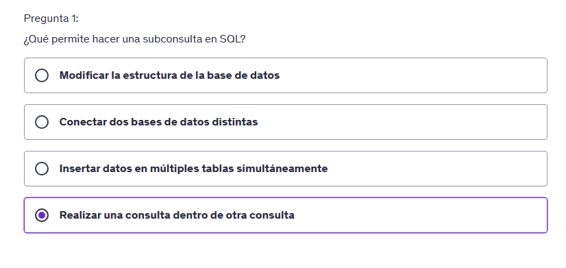
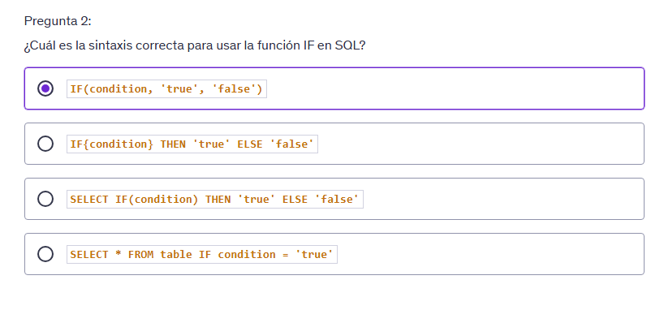
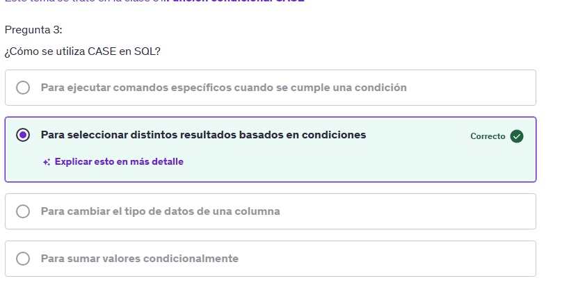
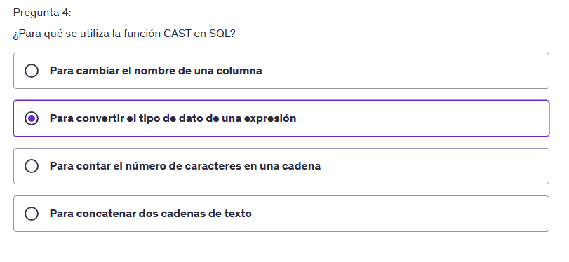
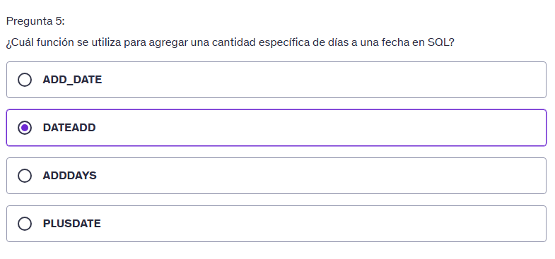
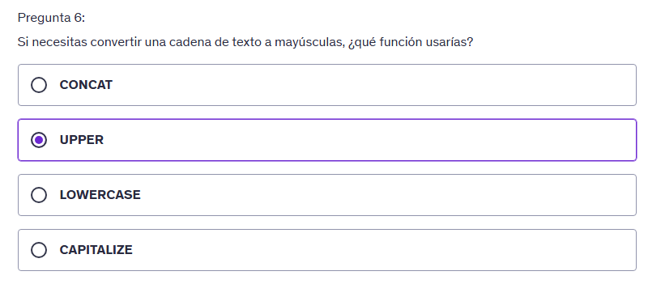
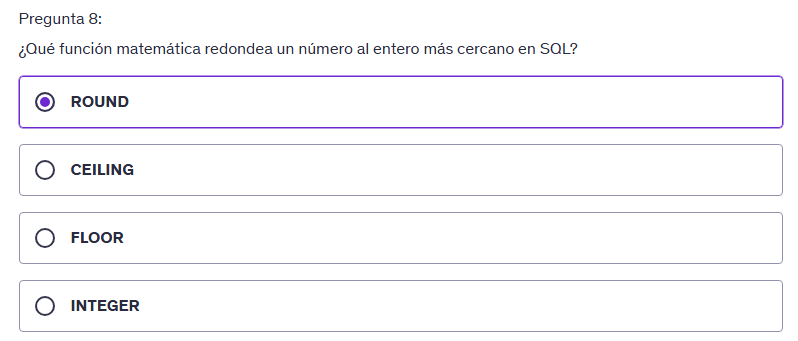

# Subconsultas

Las subconsultas son consultas que se ejecutan dentro de otra consulta.

Ejemplo obtener todos los episodios de The Office

```SQL
SELECT * FROM episodes WHERE series_id = (SELECT id FROM series WHERE name = 'The Office');
```

Esta consulta lo que realiza es buscar el id de la serie The Office y luego buscar todos los episodios que pertenecen a esa serie.

Esta consulta retorna el id de la serie The Office.

```sql
SELECT id FROM series WHERE name = 'The Office'
```

y esta consulta retorna todos los episodios que pertenecen a la serie con el id obtenido de la subconsulta.

```sql
SELECT * FROM episodes WHERE series_id = EL VALOR RETORNO DE LA SUBCONSULTA
```

## Práctica Subconsultas

Enunciado:

Escribe una consulta SQL que genere una lista de titulo de series cuyos episodios en promedio tienen un rating de IMDb mayor a 8.

Utiliza una subconsulta para seleccionar todos los serie_id que cumplen con esta condición.

Sugerencias:

La consulta principal debe seleccionar el campo titulo de las series de la tabla Series

Debes utilizar la cláusula WHERE para filtrar por serie_id

En la condición WHERE solo deberás incluir los serie_id que obtengas como resultado a partir de tu subconsulta

Recuerda que la subconsulta va dentro de paréntesis y se utiliza dentro de la cláusula WHERE de la consulta principal

Código de ejemplo para filtrar por serie_id:

```sql
SELECT titulo
FROM Series
WHERE serie_id IN ( SELECT serie_id
FROM episodios
GROUP BY serie_id
HAVING AVG(duracion) > 30);
```

Base de datos NetflixDB

Tabla: Actores

+-------------------+----------+
| Nombre de Columna | Tipo |
+-------------------+----------+
| actor_id | int |
| nombre | text |
| fecha_nacimiento | date |
+-------------------+----------+
actor_id es la clave primaria (columna con valores únicos) para esta tabla.
Cada fila de esta tabla indica el ID, nombre y fecha de nacimiento de un actor.

Tabla: Series

+-------------------+----------+
| Nombre de Columna | Tipo |
+-------------------+----------+
| serie_id | int |
| titulo | text |
| descripcion | text |
| año_lanzamiento | int |
| genero | text |
+-------------------+----------+
serie_id es la clave primaria (columna con valores únicos) para esta tabla.
Cada fila de esta tabla indica el ID, título, descripción, año de lanzamiento y género de una serie.

Tabla: Episodios

+-------------------+----------+
| Nombre de Columna | Tipo |
+-------------------+----------+
| episodio_id | int |
| serie_id | int |
| titulo | text |
| duracion | int |
| rating_imdb | int |
| temporada | int |
| descripcion | text |
| fecha_estreno | date |
+-------------------+----------+
episodio_id es la clave primaria (columna con valores únicos) para esta tabla.
serie_id es una clave foránea (columnas de referencia) de la serie_id de la tabla Series.
Cada fila de esta tabla indica el ID de un episodio, el ID de la serie a la que pertenece, título, duración, rating en IMDb, temporada, descripción y fecha de estreno.

Tabla: Actuaciones

+-------------------+----------+
| Nombre de Columna | Tipo |
+-------------------+----------+
| actor_id | int |
| serie_id | int |
| personaje | text |
+-------------------+----------+
actor_id y serie_id son claves primarias compuestas para esta tabla, y cada una es también una clave foránea que referencia las tablas Actores y Series, respectivamente.
Cada fila de esta tabla indica el ID del actor, el ID de la serie y el personaje interpretado por el actor en la serie.

```sql
SELECT titulo
FROM Series
WHERE serie_id
	IN ( SELECT serie_id
        FROM episodios
        GROUP BY serie_id
        HAVING AVG(rating_imdb)>8);
```

## FUNCIÓN CONDICIONAL IF

La función IF() devuelve un valor si una condicón es VERDADERA, u otro valor si una condicón es FALSA.

```SQL
SELECT IF (500<1000, "La condicion es verdadera", "La condicion es falsa");
```

Tenemos que identificar los epizodios con altos y bajos ratings IMDb.

```SQL
SELECT titulo, rating_imdb,
IF (rating_imdb>=8, "Alto", "Bajo") AS 'Categoria de rating'
FROM episodios;
```

Categorizar los actores cuya fecha de nacimiento sea mayor a 2000

```SQL
SELECT nombre, YEAR(fecha_nacimiento) as 'anio de nacimiento',
IF (YEAR(fecha_nacimiento)>=2000, "Young", "Old") AS 'Categoria de actores'
FROM actores;
```

## FUNCIÓN CASE

El comando CASE se utiliza para crear resultados diferentes según varias condiciones.

```SQL
SELECT
    titulo,
    año_lanzamiento,
    CASE
        WHEN año_lanzamiento>=2000 THEN "Nueva"
        WHEN año_lanzamiento<2000 THEN "Antigua"
        ELSE "Moderna"
    END AS 'Categoria de series'
FROM series;
```

Clasificar las series de netflix db, para categorizarlas, como nueva, clasica y antigua

```SQL
SELECT
    titulo,
    año_lanzamiento,
    CASE
        WHEN año_lanzamiento>=2020 THEN "Nueva"
        WHEN año_lanzamiento BETWEEN 2010 AND 2019 THEN "Clasica"
        ELSE "Antigua"
    END AS 'Categoria'
FROM series;
```

La ventaja de case vs if es que case permite evaluar varias condiciones al mismo tiempo.

## Práctica CASE 1

Enunciado:

Escribe una consulta SQL que seleccione el titulo de todas las series de la tabla Series junto con una nueva columna denominada 'Antigüedad'.

Esta columna debe mostrar 'Antigua' para las series lanzadas antes del año 2010 y 'Reciente' para las series lanzadas en 2010 o después, puedes utilizar el campo año_lanzamiento para realizar dicha clasificación.

## Sugerencias:

Utiliza la expresión CASE para realizar esta clasificación, a continuación puedes encontrar la syntaxis de la expresión CASE:

```SQL
CASE
WHEN genero = 'Comedia' THEN 'Cómica'
ELSE 'Otro'
END AS 'tipo_de_genero'
```

Base de datos NetflixDB

Tabla: Actores

+-------------------+----------+
| Nombre de Columna | Tipo |
+-------------------+----------+
| actor_id | int |
| nombre | text |
| fecha_nacimiento | date |
+-------------------+----------+
actor_id es la clave primaria (columna con valores únicos) para esta tabla.
Cada fila de esta tabla indica el ID, nombre y fecha de nacimiento de un actor.

Tabla: Series

+-------------------+----------+
| Nombre de Columna | Tipo |
+-------------------+----------+
| serie_id | int |
| titulo | text |
| descripcion | text |
| año_lanzamiento | int |
| genero | text |
+-------------------+----------+
serie_id es la clave primaria (columna con valores únicos) para esta tabla.
Cada fila de esta tabla indica el ID, título, descripción, año de lanzamiento y género de una serie.

Tabla: Episodios

+-------------------+----------+
| Nombre de Columna | Tipo |
+-------------------+----------+
| episodio_id | int |
| serie_id | int |
| titulo | text |
| duracion | int |
| rating_imdb | int |
| temporada | int |
| descripcion | text |
| fecha_estreno | date |
+-------------------+----------+
episodio_id es la clave primaria (columna con valores únicos) para esta tabla.
serie_id es una clave foránea (columnas de referencia) de la serie_id de la tabla Series.
Cada fila de esta tabla indica el ID de un episodio, el ID de la serie a la que pertenece, título, duración, rating en IMDb, temporada, descripción y fecha de estreno.

Tabla: Actuaciones

+-------------------+----------+
| Nombre de Columna | Tipo |
+-------------------+----------+
| actor_id | int |
| serie_id | int |
| personaje | text |
+-------------------+----------+
actor_id y serie_id son claves primarias compuestas para esta tabla, y cada una es también una clave foránea que referencia las tablas Actores y Series, respectivamente.
Cada fila de esta tabla indica el ID del actor, el ID de la serie y el personaje interpretado por el actor en la serie.

```sql

SELECT
    titulo,
    CASE
        WHEN año_lanzamiento < 2010 THEN "Antigua"
        ELSE "Reciente"
    END AS 'Antigüedad'
FROM series;

```

## Práctica CASE 2

Enunciado:

Escribe una consulta SQL que seleccione el titulo de todas las series y una nueva columna llamada 'Categoría de Género'

Esta columna debe reflejar si el género de la serie es 'Drama' o 'Comedia', clasificándolas como 'Dramático' o 'Divertido', respectivamente.

Para cualquier otro género, la clasificación debe ser 'Otro'.

Usa la sentencia CASE para asignar estas categorías.

## Base de datos NetflixDB

Tabla: Actores

+-------------------+----------+
| Nombre de Columna | Tipo |
+-------------------+----------+
| actor_id | int |
| nombre | text |
| fecha_nacimiento | date |
+-------------------+----------+
actor_id es la clave primaria (columna con valores únicos) para esta tabla.
Cada fila de esta tabla indica el ID, nombre y fecha de nacimiento de un actor.

Tabla: Series

+-------------------+----------+
| Nombre de Columna | Tipo |
+-------------------+----------+
| serie_id | int |
| titulo | text |
| descripcion | text |
| año_lanzamiento | int |
| genero | text |
+-------------------+----------+
serie_id es la clave primaria (columna con valores únicos) para esta tabla.
Cada fila de esta tabla indica el ID, título, descripción, año de lanzamiento y género de una serie.

Tabla: Episodios

+-------------------+----------+
| Nombre de Columna | Tipo |
+-------------------+----------+
| episodio_id | int |
| serie_id | int |
| titulo | text |
| duracion | int |
| rating_imdb | int |
| temporada | int |
| descripcion | text |
| fecha_estreno | date |
+-------------------+----------+
episodio_id es la clave primaria (columna con valores únicos) para esta tabla.
serie_id es una clave foránea (columnas de referencia) de la serie_id de la tabla Series.
Cada fila de esta tabla indica el ID de un episodio, el ID de la serie a la que pertenece, título, duración, rating en IMDb, temporada, descripción y fecha de estreno.

Tabla: Actuaciones

+-------------------+----------+
| Nombre de Columna | Tipo |
+-------------------+----------+
| actor_id | int |
| serie_id | int |
| personaje | text |
+-------------------+----------+
actor_id y serie_id son claves primarias compuestas para esta tabla, y cada una es también una clave foránea que referencia las tablas Actores y Series, respectivamente.
Cada fila de esta tabla indica el ID del actor, el ID de la serie y el personaje interpretado por el actor en la serie.

```sql
SELECT
    titulo,
    CASE
        WHEN genero = 'Drama' THEN 'Dramático'
        WHEN genero = 'Comedia' THEN 'Divertido'
        ELSE 'Otro'
    END AS 'Categoría de Género'
FROM series;
```

## Función de Transformación CAST

¿Qué es un tipo de dato?

- Coleccion o agrupación de valores de datos, generalmente especificados por un conjunto de valores posibles.

- Datos de enteros (INT)
- Datos de texto (TEXT)
- Datos de fecha (DATE)
- Datos de decimal (DECIMAL)
- Datos de booleano (BOOLEAN)
- Datos de binario (BINARY)
- Datos de carácter (VARCHAR)

### ¿Qué hace CAST?

La función CAST() convierte un valor (de cualqier tipo) en un tipo de datos específico.

CAST() te ayuda a convertir un campo en un tipo de datos específico

Ver los tipos de datos de la tabla Episodios

```sql
DESCRIBE episodios;
```

CAST() te ayuda a convertir un campo en un tipo de datos específico, en el caso de la fecha, lo convierte en un tipo de datos DATE.

```sql
SELECT * FROM episodios
WHERE CAST(fecha_estreno AS DATE) > '2010-01-01';
```

### Práctica CAST

Enunciado:

Escribe una consulta SQL para seleccionar el título de las series y el año de lanzamiento.

Sin embargo, en esta ocasión, debes convertir el año de lanzamiento de un número entero a texto (cadena de caracteres) usando la función CAST

Base de datos NetflixDB

Tabla: Actores

+-------------------+----------+
| Nombre de Columna | Tipo |
+-------------------+----------+
| actor_id | int |
| nombre | text |
| fecha_nacimiento | date |
+-------------------+----------+
actor_id es la clave primaria (columna con valores únicos) para esta tabla.
Cada fila de esta tabla indica el ID, nombre y fecha de nacimiento de un actor.

Tabla: Series

+-------------------+----------+
| Nombre de Columna | Tipo |
+-------------------+----------+
| serie_id | int |
| titulo | text |
| descripcion | text |
| año_lanzamiento | int |
| genero | text |
+-------------------+----------+
serie_id es la clave primaria (columna con valores únicos) para esta tabla.
Cada fila de esta tabla indica el ID, título, descripción, año de lanzamiento y género de una serie.

Tabla: Episodios

+-------------------+----------+
| Nombre de Columna | Tipo |
+-------------------+----------+
| episodio_id | int |
| serie_id | int |
| titulo | text |
| duracion | int |
| rating_imdb | int |
| temporada | int |
| descripcion | text |
| fecha_estreno | date |
+-------------------+----------+
episodio_id es la clave primaria (columna con valores únicos) para esta tabla.
serie_id es una clave foránea (columnas de referencia) de la serie_id de la tabla Series.
Cada fila de esta tabla indica el ID de un episodio, el ID de la serie a la que pertenece, título, duración, rating en IMDb, temporada, descripción y fecha de estreno.

Tabla: Actuaciones

+-------------------+----------+
| Nombre de Columna | Tipo |
+-------------------+----------+
| actor_id | int |
| serie_id | int |
| personaje | text |
+-------------------+----------+
actor_id y serie_id son claves primarias compuestas para esta tabla, y cada una es también una clave foránea que referencia las tablas Actores y Series, respectivamente.
Cada fila de esta tabla indica el ID del actor, el ID de la serie y el personaje interpretado por el actor en la serie.

```SQL
SELECT
    titulo, CAST(año_lanzamiento as TEXT) AS 'Año de Lanzamiento'
FROM series;

```

## Funciones de fecha y hora

- YEAR() devuelve la parte del año para una fecha especifica.
- MONTH() y DAY() funcionan de forma mas parecida pero con mes y dia respectivamente.
- DATEADD() Agrega un intervalo de hora/fecha a una fecha y devuelve la fecha.

Seleccionarel año de la fecha de estreno de los episodios

```SQL
SELECT fecha_estreno, YEAR(fecha_estreno) AS 'Año de estreno' FROM episodios;
```

Lo mismo se puede hacer con el mes

```SQL
SELECT fecha_estreno, MONTH(fecha_estreno) AS 'Mes de estreno' FROM episodios;
```

Tambien se pueden añadir dias a la fecha

```SQL
SELECT fecha_estreno, DATE_ADD(fecha_estreno, INTERVAL 20 DAY) AS 'Fecha de estreno + 20 dias' FROM episodios;
```

Saber cuantos dias pasaron desde el estreno de los episodios hasta la fecha actual

```SQL
SELECT fecha_estreno, DATEDIFF(CURDATE(), fecha_estreno) AS 'Dias desde estreno' FROM episodios;
```

## Manipulación de cadenas de texto

Son metodos que nos permiten manipular cadenas de texto.

```SQL
SELECT UPPER(titulo) AS 'Titulo en mayusculas' FROM series;
SELECT LOWER(titulo) AS 'Titulo en minusculas' FROM series;
SELECT titulo, LENGTH(titulo) AS 'Longitud del titulo' FROM series;
SELECT titulo, SUBSTRING(titulo, 1, 5) AS 'Titulo cortado' FROM series;
SELECT CONCAT(titulo, '(', año_lanzamiento, ')') AS 'Titulo y año de lanzamiento' FROM series;

SELECT
    titulo,
    LEFT(titulo, 3) AS 'Inicio del titulo',
    RIGHT(titulo, 3) AS 'Fin del titulo'
FROM series;

```

## Práctica UPPER

Enunciado:

Escribe una consulta SQL que utilice la función UPPER para convertir el título de todas las series en la tabla Series a mayúsculas.

Asigna un alias titulo_mayusculas al resultado.

Resultado esperado:

+-------------------+
| titulo_mayusculas |
+-------------------+
| BREAKING BAD |
| STRANGER THINGS |
| THE CROWN |
| ... |
+-------------------+

Base de datos NetflixDB

Tabla: Actores

+-------------------+----------+
| Nombre de Columna | Tipo |
+-------------------+----------+
| actor_id | int |
| nombre | text |
| fecha_nacimiento | date |
+-------------------+----------+
actor_id es la clave primaria (columna con valores únicos) para esta tabla.
Cada fila de esta tabla indica el ID, nombre y fecha de nacimiento de un actor.

Tabla: Series

+-------------------+----------+
| Nombre de Columna | Tipo |
+-------------------+----------+
| serie_id | int |
| titulo | text |
| descripcion | text |
| año_lanzamiento | int |
| genero | text |
+-------------------+----------+
serie_id es la clave primaria (columna con valores únicos) para esta tabla.
Cada fila de esta tabla indica el ID, título, descripción, año de lanzamiento y género de una serie.

Tabla: Episodios

+-------------------+----------+
| Nombre de Columna | Tipo |
+-------------------+----------+
| episodio_id | int |
| serie_id | int |
| titulo | text |
| duracion | int |
| rating_imdb | int |
| temporada | int |
| descripcion | text |
| fecha_estreno | date |
+-------------------+----------+
episodio_id es la clave primaria (columna con valores únicos) para esta tabla.
serie_id es una clave foránea (columnas de referencia) de la serie_id de la tabla Series.
Cada fila de esta tabla indica el ID de un episodio, el ID de la serie a la que pertenece, título, duración, rating en IMDb, temporada, descripción y fecha de estreno.

Tabla: Actuaciones

+-------------------+----------+
| Nombre de Columna | Tipo |
+-------------------+----------+
| actor_id | int |
| serie_id | int |
| personaje | text |
+-------------------+----------+
actor_id y serie_id son claves primarias compuestas para esta tabla, y cada una es también una clave foránea que referencia las tablas Actores y Series, respectivamente.
Cada fila de esta tabla indica el ID del actor, el ID de la serie y el personaje interpretado por el actor en la serie.

```SQL
SELECT UPPER(titulo) AS titulo_mayusculas
FROM series;
```

## Práctica SUBSTR

Enunciado:

Escribe una consulta SQL que utilice la función SUBSTR para extraer los primeros 5 caracteres del título de cada episodio en la tabla Episodios.

Asigna un alias primeros_cinco_caracteres al resultado.

Resultado esperado:

+---------------------------+
| primeros_cinco_caracteres |
+---------------------------+
| Pilot |
| Gato |
| Manda |
| Phoen |
| ABQ |
| ... |
+---------------------------+

Base de datos NetflixDB

Tabla: Actores

+-------------------+----------+
| Nombre de Columna | Tipo |
+-------------------+----------+
| actor_id | int |
| nombre | text |
| fecha_nacimiento | date |
+-------------------+----------+
actor_id es la clave primaria (columna con valores únicos) para esta tabla.
Cada fila de esta tabla indica el ID, nombre y fecha de nacimiento de un actor.

Tabla: Series

+-------------------+----------+
| Nombre de Columna | Tipo |
+-------------------+----------+
| serie_id | int |
| titulo | text |
| descripcion | text |
| año_lanzamiento | int |
| genero | text |
+-------------------+----------+
serie_id es la clave primaria (columna con valores únicos) para esta tabla.
Cada fila de esta tabla indica el ID, título, descripción, año de lanzamiento y género de una serie.

Tabla: Episodios

+-------------------+----------+
| Nombre de Columna | Tipo |
+-------------------+----------+
| episodio_id | int |
| serie_id | int |
| titulo | text |
| duracion | int |
| rating_imdb | int |
| temporada | int |
| descripcion | text |
| fecha_estreno | date |
+-------------------+----------+
episodio_id es la clave primaria (columna con valores únicos) para esta tabla.
serie_id es una clave foránea (columnas de referencia) de la serie_id de la tabla Series.
Cada fila de esta tabla indica el ID de un episodio, el ID de la serie a la que pertenece, título, duración, rating en IMDb, temporada, descripción y fecha de estreno.

Tabla: Actuaciones

+-------------------+----------+
| Nombre de Columna | Tipo |
+-------------------+----------+
| actor_id | int |
| serie_id | int |
| personaje | text |
+-------------------+----------+
actor_id y serie_id son claves primarias compuestas para esta tabla, y cada una es también una clave foránea que referencia las tablas Actores y Series, respectivamente.
Cada fila de esta tabla indica el ID del actor, el ID de la serie y el personaje interpretado por el actor en la serie.

```sql
SELECT  SUBSTRING(titulo, 1, 5) AS 'primeros_cinco_caracteres'
FROM Episodios;
```

## Funciones matematicas

- FLOOR() redondea un numero hacia abajo.
- CEIL() redondea un numero hacia arriba.
- ROUND() redondea un numero hacia el numero mas cercano.

```SQL
SELECT titulo, duracion/60.0 AS Horas_completas, ROUND(duracion/60.0) AS Horas_redondeadas FROM Episodios;

SELECT titulo,duracion, CEIL(duracion/60.0) AS Horas_Completas FROM Episodios;

SELECT titulo,duracion, FLOOR(duracion/60.0) AS Horas_Completas FROM Episodios;
```

## Práctica CEILING

Enunciado:

Escribe una consulta SQL que utilice la función CEILING para redondear hacia arriba los números de la columna rating_imdb en la tabla Episodios

Asigna un alias rating_redondeado al resultado

Resultado esperado:

+---------------------------+
| rating_redondeado |
+---------------------------+
| 9 |
| 9 |
| 9 |
| 10 |
| 10 |
| ... |
+---------------------------+

Base de datos NetflixDB

Tabla: Actores

+-------------------+----------+
| Nombre de Columna | Tipo |
+-------------------+----------+
| actor_id | int |
| nombre | text |
| fecha_nacimiento | date |
+-------------------+----------+
actor_id es la clave primaria (columna con valores únicos) para esta tabla.
Cada fila de esta tabla indica el ID, nombre y fecha de nacimiento de un actor.

Tabla: Series

+-------------------+----------+
| Nombre de Columna | Tipo |
+-------------------+----------+
| serie_id | int |
| titulo | text |
| descripcion | text |
| año_lanzamiento | int |
| genero | text |
+-------------------+----------+
serie_id es la clave primaria (columna con valores únicos) para esta tabla.
Cada fila de esta tabla indica el ID, título, descripción, año de lanzamiento y género de una serie.

Tabla: Episodios

+-------------------+----------+
| Nombre de Columna | Tipo |
+-------------------+----------+
| episodio_id | int |
| serie_id | int |
| titulo | text |
| duracion | int |
| rating_imdb | int |
| temporada | int |
| descripcion | text |
| fecha_estreno | date |
+-------------------+----------+
episodio_id es la clave primaria (columna con valores únicos) para esta tabla.
serie_id es una clave foránea (columnas de referencia) de la serie_id de la tabla Series.
Cada fila de esta tabla indica el ID de un episodio, el ID de la serie a la que pertenece, título, duración, rating en IMDb, temporada, descripción y fecha de estreno.

Tabla: Actuaciones

+-------------------+----------+
| Nombre de Columna | Tipo |
+-------------------+----------+
| actor_id | int |
| serie_id | int |
| personaje | text |
+-------------------+----------+
actor_id y serie_id son claves primarias compuestas para esta tabla, y cada una es también una clave foránea que referencia las tablas Actores y Series, respectivamente.
Cada fila de esta tabla indica el ID del actor, el ID de la serie y el personaje interpretado por el actor en la serie.

```SQL
SELECT CEILING(rating_imdb) AS 'rating_redondeado'
FROM Episodios;
```

## Quiz
















## Proyecto del dia

- Correr una subconsulta de sql
- Utiliza una subconsulta para identificar los tres generos mas populares
  (en funcion de la cantidade de series que pertenecen a cada genero)

- Para cada genero identificado identifica el titulo de la serie,
  año de lanzamiento y rating imdb promedio

```SQL
SELECT genero
FROM series
GROUP BY genero
ORDER BY COUNT(*) DESC
LIMIT 3;
```

Tips

- Utiliza una subconsulta que seleccione los generos y cuente la cantidad de series en cada genero.
  Ordena los resultados por cantidad de serie de manera descendente y liminta los resultados a 3.

En la consulta principal filtra las series que correspondan a dichos tres generos utilizando la clausula IN
Pudes unir la tabla series con la tabla Episodios para obtener el rating imdb promedio de cada serie.

```SQL
SELECT
	s.genero,
    s.titulo,
    s.año_lanzamiento,
    AVG(e.rating_imdb) AS rating_promedio
FROM Series s
JOIN Episodios e ON s.serie_id = e.serie_id
WHERE s.genero IN (
    SELECT genero FROM (
        SELECT genero, COUNT(*) AS cantidad_de_series
        FROM Series
        GROUP BY genero
        ORDER BY cantidad_de_series DESC
        LIMIT 3
    ) AS top_generos
)
GROUP BY s.serie_id
ORDER BY rating_promedio DESC;
```
