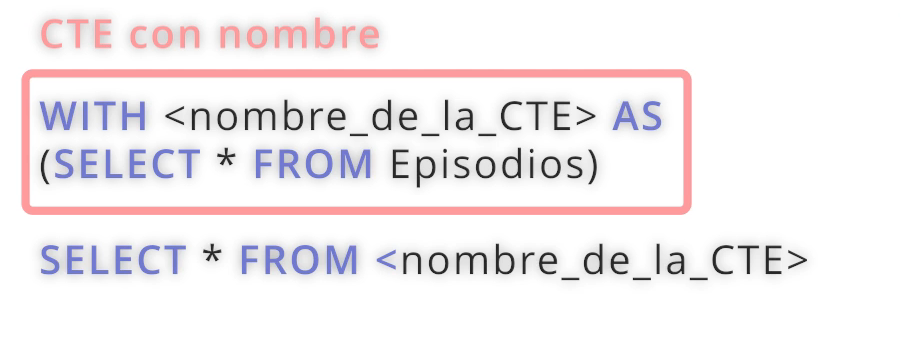
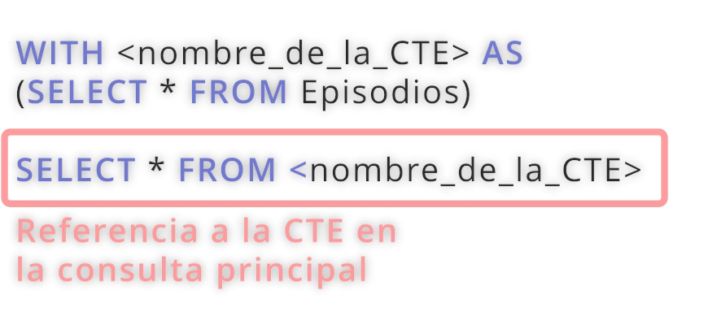

## CTEs Commomn Table Expressions

Son similares a las consultas con WITH, consultas temporales que se definen en una consulta y se pueden reutilizar en la consulta principal.





```sql
WITH ListaEpisodios AS (
    SELECT serie_id, episodio_id, titulo
    FROM episodios
)

WITH ListaSeries AS (
    SELECT serie_id, descripcion
    FROM series
)

SELECT * FROM ListaEpisodios
LEFT JOIN ListaSeries
ON ListaEpisodios.serie_id = ListaSeries.serie_id;
```

## Ejercicio

### Práctica CTE 1

Enunciado:

Escribe una consulta SQL empleando una CTE para determinar la fecha del primer episodio transmitido de cada serie.

Debes seleccionar el título de cada serie y la fecha del primer episodio, presentando estos datos en dos columnas finales llamadas 'Título de la Serie' y 'Fecha del Primer Episodio'

Ordena los resultados por la fecha del primer episodio de forma ascendente.

Sugerencias:

Para obtener la fecha del primer episodio transmitido puede aplicar una CTE para obtener serie_id junto con MIN(fecha_estreno) para obtener la fecha más antigua de episodio desde la tabla Episodios para dicha Serie

Utiliza GROUP BY cuando quieres aplicar funciones agregadas como MIN()

Puedes utilizar INNER JOIN para combinar los resultados de tu consulta principal con los resultados de la CTE

Base de datos NetflixDB

Tabla: Actores

+-------------------+----------+
| Nombre de Columna | Tipo |
+-------------------+----------+
| actor_id | int |
| nombre | text |
| fecha_nacimiento | date |
+-------------------+----------+
actor_id es la clave primaria (columna con valores únicos) para esta tabla.
Cada fila de esta tabla indica el ID, nombre y fecha de nacimiento de un actor.

Tabla: Series

+-------------------+----------+
| Nombre de Columna | Tipo |
+-------------------+----------+
| serie_id | int |
| titulo | text |
| descripcion | text |
| año_lanzamiento | int |
| genero | text |
+-------------------+----------+
serie_id es la clave primaria (columna con valores únicos) para esta tabla.
Cada fila de esta tabla indica el ID, título, descripción, año de lanzamiento y género de una serie.

Tabla: Episodios

+-------------------+----------+
| Nombre de Columna | Tipo |
+-------------------+----------+
| episodio_id | int |
| serie_id | int |
| titulo | text |
| duracion | int |
| rating_imdb | int |
| temporada | int |
| descripcion | text |
| fecha_estreno | date |
+-------------------+----------+
episodio_id es la clave primaria (columna con valores únicos) para esta tabla.
serie_id es una clave foránea (columnas de referencia) de la serie_id de la tabla Series.
Cada fila de esta tabla indica el ID de un episodio, el ID de la serie a la que pertenece, título, duración, rating en IMDb, temporada, descripción y fecha de estreno.

Tabla: Actuaciones

+-------------------+----------+
| Nombre de Columna | Tipo |
+-------------------+----------+
| actor_id | int |
| serie_id | int |
| personaje | text |
+-------------------+----------+
actor_id y serie_id son claves primarias compuestas para esta tabla, y cada una es también una clave foránea que referencia las tablas Actores y Series, respectivamente.
Cada fila de esta tabla indica el ID del actor, el ID de la serie y el personaje interpretado por el actor en la serie.

```sql
WITH PrimerEpisodio AS (
    SELECT serie_id, MIN(fecha_estreno) AS
    fecha_estreno
    FROM episodios
    GROUP BY serie_id
)

SELECT s.titulo AS 'Título de la Serie', pe.fecha_estreno AS 'Fecha del Primer Episodio'
FROM series s
INNER JOIN PrimerEpisodio pe ON  s.serie_id = pe.serie_id
ORDER BY pe.fecha_estreno ASC;
```

Práctica CTE 2
Enunciado:

Escribe una consulta SQL que utilice una CTE para seleccionar el número total de series lanzadas por año para un género específico, digamos "Ciencia ficción".

Ordena los resultados por año de lanzamiento

Sugerencias:

Definir la CTE:

La CTE debe contener las columnas para el año de lanzamiento (año_lanzamiento) y el conteo COUNT() de series lanzadas ese año.

Filtra las series para incluir solo aquellas cuyo genero sea igual a 'Ciencia ficción'.

Seleccionar desde la CTE:

En la consulta principal, selecciona desde tu CTE las columnas para el año de lanzamiento y el número de series lanzadas.

Asegúrate de ordenar los resultados por el año de lanzamiento para observar la tendencia a lo largo del tiempo.

Base de datos NetflixDB

Tabla: Actores

+-------------------+----------+
| Nombre de Columna | Tipo |
+-------------------+----------+
| actor_id | int |
| nombre | text |
| fecha_nacimiento | date |
+-------------------+----------+
actor_id es la clave primaria (columna con valores únicos) para esta tabla.
Cada fila de esta tabla indica el ID, nombre y fecha de nacimiento de un actor.

Tabla: Series

+-------------------+----------+
| Nombre de Columna | Tipo |
+-------------------+----------+
| serie_id | int |
| titulo | text |
| descripcion | text |
| año_lanzamiento | int |
| genero | text |
+-------------------+----------+
serie_id es la clave primaria (columna con valores únicos) para esta tabla.
Cada fila de esta tabla indica el ID, título, descripción, año de lanzamiento y género de una serie.

Tabla: Episodios

+-------------------+----------+
| Nombre de Columna | Tipo |
+-------------------+----------+
| episodio_id | int |
| serie_id | int |
| titulo | text |
| duracion | int |
| rating_imdb | int |
| temporada | int |
| descripcion | text |
| fecha_estreno | date |
+-------------------+----------+
episodio_id es la clave primaria (columna con valores únicos) para esta tabla.
serie_id es una clave foránea (columnas de referencia) de la serie_id de la tabla Series.
Cada fila de esta tabla indica el ID de un episodio, el ID de la serie a la que pertenece, título, duración, rating en IMDb, temporada, descripción y fecha de estreno.

Tabla: Actuaciones

+-------------------+----------+
| Nombre de Columna | Tipo |
+-------------------+----------+
| actor_id | int |
| serie_id | int |
| personaje | text |
+-------------------+----------+
actor_id y serie_id son claves primarias compuestas para esta tabla, y cada una es también una clave foránea que referencia las tablas Actores y Series, respectivamente.
Cada fila de esta tabla indica el ID del actor, el ID de la serie y el personaje interpretado por el actor en la serie.

```sql
WITH SeriesPorGenero AS(
    SELECT año_lanzamiento, COUNT(*) AS 'total_series'
    FROM series
    WHERE genero = "Ciencia ficcion"
    GROUP BY año_lanzamiento
)

SELECT *
FROM SeriesPorGenero
ORDER BY año_lanzamiento ASC;
```

## Funciones de ventana

Una función ventana SQL realiza cálculos a través de un conjunto de filas de la tabla que están relacionada con la fila actual.

```sql
SELECT
titulo,
año_lanzamiento,
ROW_NUMBER() OVER (ORDER BY año_lanzamiento ASC) AS  orden_lanzamiento
FROM series;
```

LAS TRES PRIMERAS SERIES EN SER LANZADAS

```sql
WITH OrderSeries AS (
    SELECT
    titulo,
    año_lanzamiento,
    ROW_NUMBER() OVER (ORDER BY año_lanzamiento ASC) AS  orden_lanzamiento
    FROM series
)
SELECT *
FROM OrderSeries
WHERE orden_lanzamiento IN (1, 2, 3);
```

### Práctica ROW_NUMBER

Enunciado:

Escribe una consulta SQL que seleccione todas las series, incluyendo su titulo y año_lanzamiento y utiliza la función de ventana ROW_NUMBER() para asignar un número secuencial a cada serie basado en su año de lanzamiento (ORDER BY año_lanzamiento DESC), de la más reciente a la más antigua, esta última columna debe tener el nombre: clasificacion_global

Base de datos NetflixDB

Tabla: Actores

+-------------------+----------+
| Nombre de Columna | Tipo |
+-------------------+----------+
| actor_id | int |
| nombre | text |
| fecha_nacimiento | date |
+-------------------+----------+
actor_id es la clave primaria (columna con valores únicos) para esta tabla.
Cada fila de esta tabla indica el ID, nombre y fecha de nacimiento de un actor.

Tabla: Series

+-------------------+----------+
| Nombre de Columna | Tipo |
+-------------------+----------+
| serie_id | int |
| titulo | text |
| descripcion | text |
| año_lanzamiento | int |
| genero | text |
+-------------------+----------+
serie_id es la clave primaria (columna con valores únicos) para esta tabla.
Cada fila de esta tabla indica el ID, título, descripción, año de lanzamiento y género de una serie.

Tabla: Episodios

+-------------------+----------+
| Nombre de Columna | Tipo |
+-------------------+----------+
| episodio_id | int |
| serie_id | int |
| titulo | text |
| duracion | int |
| rating_imdb | int |
| temporada | int |
| descripcion | text |
| fecha_estreno | date |
+-------------------+----------+
episodio_id es la clave primaria (columna con valores únicos) para esta tabla.
serie_id es una clave foránea (columnas de referencia) de la serie_id de la tabla Series.
Cada fila de esta tabla indica el ID de un episodio, el ID de la serie a la que pertenece, título, duración, rating en IMDb, temporada, descripción y fecha de estreno.

Tabla: Actuaciones

+-------------------+----------+
| Nombre de Columna | Tipo |
+-------------------+----------+
| actor_id | int |
| serie_id | int |
| personaje | text |
+-------------------+----------+
actor_id y serie_id son claves primarias compuestas para esta tabla, y cada una es también una clave foránea que referencia las tablas Actores y Series, respectivamente.
Cada fila de esta tabla indica el ID del actor, el ID de la serie y el personaje interpretado por el actor en la serie.

```sql
WITH OrderSeries AS (
    SELECT
    titulo,
    año_lanzamiento,
    ROW_NUMBER() OVER (ORDER BY año_lanzamiento DESC) AS  clasificacion_global
    FROM series
)
SELECT *
FROM OrderSeries;
```

## Partition By

```sql
SELECT
    titulo,
    genero,
    año_lanzamiento,
    ROW_NUMBER() OVER (PARTITION BY genero ORDER BY año_lanzamiento DESC) AS ranking_por_genero
    FROM series;
```

Práctica PARTITION BY 1
Enunciado:

Escribe una consulta SQL que seleccione la temporada, el título del episodio, la fecha de estreno y utilice ROW_NUMBER() en combinación con PARTITION BY para asignar un ranking de episodios basado en su fecha de estreno (de más reciente a más antiguo DESC), está nueva columna deberá tener el nombre: ranking_temporada

Sugerencias:

Selecciona las Columnas Necesarias:

Debes seleccionar tres columnas: la temporada y el titulo del episodio, y también incluir la fecha_estreno para que puedas verificar el orden de los rankings generados.

Aplica ROW_NUMBER() con PARTITION BY:

Utiliza la función de ventana ROW_NUMBER() y combínala con PARTITION BY temporada para agrupar los episodios por temporada. Dentro de cada grupo, ordena los episodios por fecha_estreno DESC para que los más recientes tengan el ranking más bajo (es decir, número 1).

Asigna el alias ranking_temporada al resultado de ROW_NUMBER()

## Base de datos NetflixDB

Tabla: Actores

+-------------------+----------+
| Nombre de Columna | Tipo |
+-------------------+----------+
| actor_id | int |
| nombre | text |
| fecha_nacimiento | date |
+-------------------+----------+
actor_id es la clave primaria (columna con valores únicos) para esta tabla.
Cada fila de esta tabla indica el ID, nombre y fecha de nacimiento de un actor.

Tabla: Series

+-------------------+----------+
| Nombre de Columna | Tipo |
+-------------------+----------+
| serie_id | int |
| titulo | text |
| descripcion | text |
| año_lanzamiento | int |
| genero | text |
+-------------------+----------+
serie_id es la clave primaria (columna con valores únicos) para esta tabla.
Cada fila de esta tabla indica el ID, título, descripción, año de lanzamiento y género de una serie.

Tabla: Episodios

+-------------------+----------+
| Nombre de Columna | Tipo |
+-------------------+----------+
| episodio_id | int |
| serie_id | int |
| titulo | text |
| duracion | int |
| rating_imdb | int |
| temporada | int |
| descripcion | text |
| fecha_estreno | date |
+-------------------+----------+
episodio_id es la clave primaria (columna con valores únicos) para esta tabla.
serie_id es una clave foránea (columnas de referencia) de la serie_id de la tabla Series.
Cada fila de esta tabla indica el ID de un episodio, el ID de la serie a la que pertenece, título, duración, rating en IMDb, temporada, descripción y fecha de estreno.

Tabla: Actuaciones

+-------------------+----------+
| Nombre de Columna | Tipo |
+-------------------+----------+
| actor_id | int |
| serie_id | int |
| personaje | text |
+-------------------+----------+
actor_id y serie_id son claves primarias compuestas para esta tabla, y cada una es también una clave foránea que referencia las tablas Actores y Series, respectivamente.
Cada fila de esta tabla indica el ID del actor, el ID de la serie y el personaje interpretado por el actor en la serie.

```sql
SELECT
    temporada,
    titulo,
    fecha_estreno,
    ROW_NUMBER() OVER (PARTITION BY temporada ORDER BY fecha_estreno DESC) AS ranking_temporada
    FROM episodios;
```

## Práctica PARTITION BY 2

Enunciado:

Escribe una consulta de SQL que genere un ranking de episodios para cada temporada de Stranger Things (serie_id = 2) basándose en las calificaciones de IMDb, de modo que puedas identificar los episodios mejor valorados dentro de cada temporada.

Sugerencias:

Seleccionar Columnas Relevantes:

Selecciona temporada, titulo y rating_imdb de la tabla Episodios.

Aplica ROW_NUMBER() para asignar rangos:

Utiliza la función de ventana ROW_NUMBER() en combinación con OVER (PARTITION BY temporada ORDER BY rating_imdb DESC) para asignar un ranking a cada episodio dentro de su respectiva temporada, basándose en su rating de IMDb.

Esto asegura que el episodio con el rating más alto en cada temporada reciba el ranking 1, y así sucesivamente.

Recuerda definirle un alias Ranking IMDb

Filtrar por Serie Específica:

Asegúrate de filtrar los resultados para incluir solo los episodios de "Stranger Things", utilizando WHERE serie_id = 2

Ordenar el Resultado Final:

Ordena los resultados primero por temporada y luego por Ranking IMDb para facilitar la interpretación de los datos.

Base de datos NetflixDB

Tabla: Actores

+-------------------+----------+
| Nombre de Columna | Tipo |
+-------------------+----------+
| actor_id | int |
| nombre | text |
| fecha_nacimiento | date |
+-------------------+----------+
actor_id es la clave primaria (columna con valores únicos) para esta tabla.
Cada fila de esta tabla indica el ID, nombre y fecha de nacimiento de un actor.

Tabla: Series

+-------------------+----------+
| Nombre de Columna | Tipo |
+-------------------+----------+
| serie_id | int |
| titulo | text |
| descripcion | text |
| año_lanzamiento | int |
| genero | text |
+-------------------+----------+
serie_id es la clave primaria (columna con valores únicos) para esta tabla.
Cada fila de esta tabla indica el ID, título, descripción, año de lanzamiento y género de una serie.

Tabla: Episodios

+-------------------+----------+
| Nombre de Columna | Tipo |
+-------------------+----------+
| episodio_id | int |
| serie_id | int |
| titulo | text |
| duracion | int |
| rating_imdb | int |
| temporada | int |
| descripcion | text |
| fecha_estreno | date |
+-------------------+----------+
episodio_id es la clave primaria (columna con valores únicos) para esta tabla.
serie_id es una clave foránea (columnas de referencia) de la serie_id de la tabla Series.
Cada fila de esta tabla indica el ID de un episodio, el ID de la serie a la que pertenece, título, duración, rating en IMDb, temporada, descripción y fecha de estreno.

Tabla: Actuaciones

+-------------------+----------+
| Nombre de Columna | Tipo |
+-------------------+----------+
| actor_id | int |
| serie_id | int |
| personaje | text |
+-------------------+----------+
actor_id y serie_id son claves primarias compuestas para esta tabla, y cada una es también una clave foránea que referencia las tablas Actores y Series, respectivamente.
Cada fila de esta tabla indica el ID del actor, el ID de la serie y el personaje interpretado por el actor en la serie.

```sql
SELECT
    temporada,
    titulo,
    rating_imdb,
    ROW_NUMBER() OVER (PARTITION BY temporada ORDER BY rating_imdb DESC) AS 'Ranking IMDb'
    FROM episodios
    WHERE serie_id = 2;
```

´

## RANK
