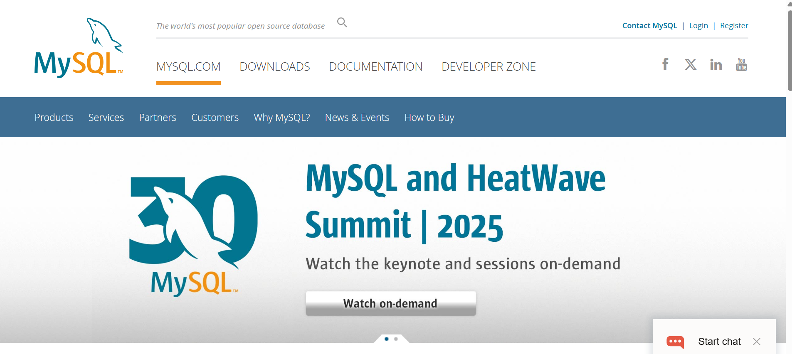

## Instalación de MySql y MySQL Workbench

Debemos ir a la pagina web de mysql:

```
https://www.mysql.com/
```



Y descargamos el instalador de MySQL.


Y seleccionamos el MySQL for Windows (x64),


Vamos a descargar el instalador que pesa cerca de 296 MB.


Para ejecutar el instalador, debemos darle permisos de administrador y decir que si a todo.

Una vez abierto el instalador, selccionamos la opcion de instalación personalizada.


Los productos que debemos seleccionar en la instalación es MySQL Server y MySQL Workbench, donde el primero es el motor de base de datos y el segundo es la herramienta para gestionar la base de datos, despues de seleccionarlos, damos siguiente.


Despues le damos click en ejecutar.


Presionamos siguiente y siguinete, hasta que aparezca la pantalla de Type and Network. Donde configuramos de la siguiente forma la conección de red y damos siguiente.


Utilizamos el tipo de encriptacion fuerte.


Despues configuramos el usuario root y la contraseña, en mi caso es **root** y damos siguiente.


Mantenemos la configuración estandar del servicio de windows y damos siguiente.


Garantizamos el full acceso al usuario root y damos siguiente.


Una vez completado el proceso de instalación, se muestra la siguiente pantalla.


Al dar click en finish, se muestra la siguiente pantalla, donde ya podemos iniciar la base de datos.


## Primeros pasos con MySQL Workbench

Se puede seleccionar la instancia local para conectarnos al motor de base de datos local.

En la coneccion de servidor, se muestra la siguiente pantalla, donde de lado derecho se encuentra la pestaña de administración, donde nos viene informacion del servidor.


El la opcion de Server Status se encuentra el estado del servidor, si esta corriendo o no.


Gestionar usuarios y permisos de los usuarios.


La opción de data export, nos ayuda a guardar la informacion de la base de dtos en un archivo .sql:


En la seccion de SCHEMAS, se encuentra la lista de las bases de datos que tenemos en el servidor. La base de datos es la coleccion de información, SYS es la base de datos por defecto.


La pestaña query es donde podemos escribir codigo sql.

